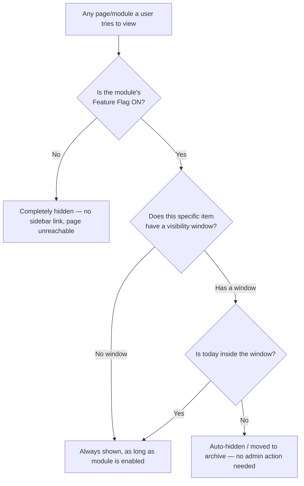

# SRKR Coding Club Platform — Documentation

> One Platform. Many Features. Limitless Possibilities.
> A unified platform for SRKR Coding Club to manage events, registrations, career, hackathons, codequest, daily problems, memberships and more — all from a single codebase with powerful admin control.

This is the documentation home for the whole platform. It's written to be understandable by **every club member**, not just developers — if you're looking for "what does this button do" or "how does this module work," you're in the right place. Admin-only material lives in its own [admin/](admin/) folder so it's clearly separated from what any member can read.

## How These Docs Are Organized

```
docs/
├── README.md                  ← you are here
├── glossary.md                ← plain-language definitions of every term used
├── architecture/               ← how the platform is built (for the curious + developers)
│   ├── README.md
│   ├── tech-stack.md
│   ├── deployment-infra.md
│   ├── backup-security.md
│   └── data-model-dynamic-forms.md
├── modules/                    ← what each part of the platform does
│   ├── home.md
│   ├── hackathon.md
│   ├── iconcoders.md
│   ├── events.md
│   ├── codequest.md
│   ├── career.md
│   └── blogs.md
├── features/                   ← cross-cutting capabilities every module relies on
│   ├── feature-flags.md
│   ├── dynamic-form-builder.md
│   ├── role-based-access.md
│   ├── file-image-management.md
│   ├── scheduling.md
│   ├── data-export.md
│   ├── email-notifications.md
│   ├── audit-logs.md
│   ├── analytics-insights.md
│   └── security-scalability.md
└── admin/                       ← admin-only: how to actually run the platform
    ├── README.md
    ├── dashboard.md
    ├── module-management-feature-flags.md
    ├── form-builder-admin.md
    ├── user-role-management.md
    ├── event-hackathon-management.md
    ├── content-management.md
    └── audit-logs-monitoring.md
```

## Where Do I Start?

| I am a... | Start here |
|---|---|
| New member, just curious how the platform works | [modules/home.md](modules/home.md), then browse [modules/](modules/) |
| Participant in an event/hackathon | The relevant [modules/](modules/) doc (e.g. [modules/hackathon.md](modules/hackathon.md)) |
| Volunteer helping run something | [admin/README.md](admin/README.md) → your specific task |
| Club Lead managing content | [admin/README.md](admin/README.md) |
| Admin (full platform control) | [admin/module-management-feature-flags.md](admin/module-management-feature-flags.md) and [admin/user-role-management.md](admin/user-role-management.md) |
| Developer / technically curious | [architecture/README.md](architecture/README.md) |
| Confused by a term | [glossary.md](glossary.md) |

## The Modules, at a Glance

| Module | What it is | Docs |
|---|---|---|
| **Home** | Landing page / dashboard summarizing everything else | [modules/home.md](modules/home.md) |
| **Hackathons** | Generic engine for running any hackathon (teams, rounds, judging, results) | [modules/hackathon.md](modules/hackathon.md) |
| **IconCoders** | The club's flagship annual hackathon, built on the Hackathons engine | [modules/iconcoders.md](modules/iconcoders.md) |
| **Events** | Workshops, talks, meetups — anything that isn't a hackathon | [modules/events.md](modules/events.md) |
| **Codequest** | Daily "Problem of the Day," auto-published on schedule | [modules/codequest.md](modules/codequest.md) |
| **Career** | Internship/job listings and career resources | [modules/career.md](modules/career.md) |
| **Blog** | Club articles, tutorials, member write-ups | [modules/blogs.md](modules/blogs.md) |

## The Features That Power Every Module

| Feature | In one line | Docs |
|---|---|---|
| Feature Flags | Show/hide a whole module, or auto show/hide one item by date | [features/feature-flags.md](features/feature-flags.md) |
| Dynamic Form Builder | Build any registration/feedback form with no code | [features/dynamic-form-builder.md](features/dynamic-form-builder.md) |
| Role Based Access | Controls exactly what each person can see/do | [features/role-based-access.md](features/role-based-access.md) |
| File & Image Management | Secure, fast storage for posters, resumes, submissions | [features/file-image-management.md](features/file-image-management.md) |
| Scheduling | Auto-publish/unpublish content at set times | [features/scheduling.md](features/scheduling.md) |
| Data Export | One-click CSV/Excel export of any registration data | [features/data-export.md](features/data-export.md) |
| Custom Email & Notifications | Targeted, templated emails to the right audience | [features/email-notifications.md](features/email-notifications.md) |
| Audit Logs | Tracks every important admin action | [features/audit-logs.md](features/audit-logs.md) |
| Analytics & Insights | Dashboards on registrations, engagement, growth | [features/analytics-insights.md](features/analytics-insights.md) |
| Scalable & Secure | The design principles keeping the platform fast and safe | [features/security-scalability.md](features/security-scalability.md) |

## Visibility, in One Picture

This is the single most important mental model on the whole platform — it explains why things appear and disappear:



Full explanation: [features/feature-flags.md](features/feature-flags.md).

## Related Reading
- [glossary.md](glossary.md) — every term explained plainly
- [architecture/README.md](architecture/README.md) — how it's all built
- [admin/README.md](admin/README.md) — running the platform day-to-day
