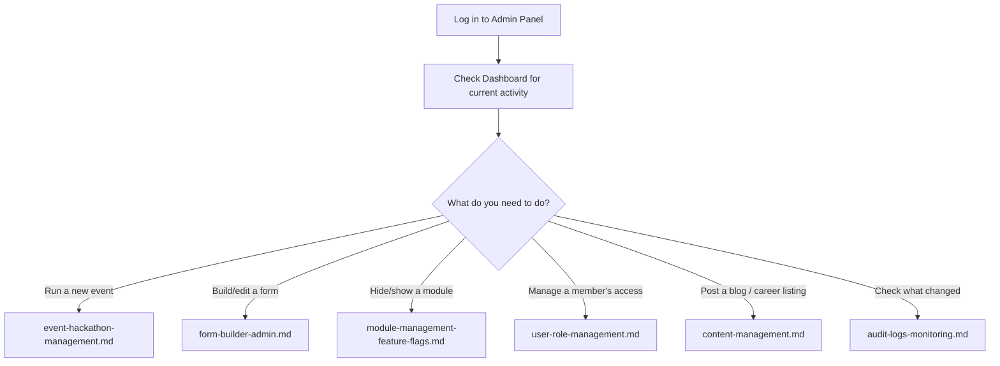

# Admin Documentation — Overview

This folder documents everything **only Admins and Club Leads** see and use — the "control room" behind every public-facing module. If you're a general member, you probably want [../modules/](../modules/) or [../features/](../features/) instead.

## Who Should Read This
- **Admin** — full platform control (roles, feature flags, all modules, audit logs).
- **Club Lead** — day-to-day content management (events, hackathons, blog, career, forms) within their area.
- **Volunteer** — limited, view-mostly access to specific things they're assigned to help with (e.g. one event's check-in list).

See [../features/role-based-access.md](../features/role-based-access.md) for the full role breakdown.

## Admin Panel Map

| Section | Doc | What it's for |
|---|---|---|
| Dashboard | [dashboard.md](dashboard.md) | At-a-glance stats: users, events, registrations, trends |
| Modules & Feature Flags | [module-management-feature-flags.md](module-management-feature-flags.md) | Turn modules on/off, set item visibility windows |
| Form Builder | [form-builder-admin.md](form-builder-admin.md) | Build/edit any registration or feedback form |
| Users & Roles | [user-role-management.md](user-role-management.md) | Manage members, assign roles/permissions |
| Events & Hackathons | [event-hackathon-management.md](event-hackathon-management.md) | Create/manage Events, Hackathons, IconCoders editions |
| Content (Blog / Career / Codequest) | [content-management.md](content-management.md) | Manage posts, listings, and daily problems |
| Audit Logs & Monitoring | [audit-logs-monitoring.md](audit-logs-monitoring.md) | See who did what, and platform health |

## First-Time Orientation (for a new Club Lead)

## Related Docs
- [../architecture/README.md](../architecture/README.md) — how the platform is built, for context
- [../features/](../features/) — deep-dive on each capability used across these admin pages
