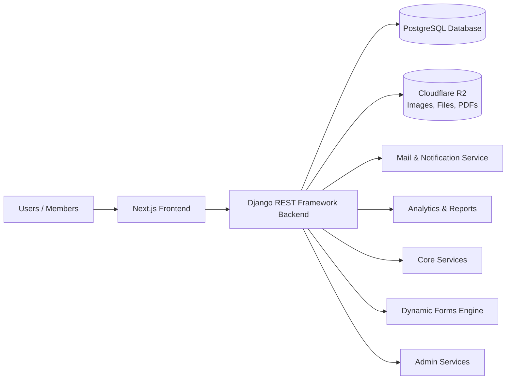

# Platform Architecture — Overview

This page explains **how the SRKR Coding Club platform is built**, in plain language. It's meant for anyone in the club — not just developers — who wants to understand how the pieces fit together. Developers should also read [tech-stack.md](tech-stack.md), [data-model-dynamic-forms.md](data-model-dynamic-forms.md), [deployment-infra.md](deployment-infra.md), and [backup-security.md](backup-security.md) for implementation-level detail.

## The Big Picture

The platform is **one codebase, many modules** (Home, Events, Hackathons, CodeFest, Daily Problems/Codequest, Career, Membership, Resources, Community, Blog). Every module can be turned on or off independently using **Feature Flags** — no redeployment needed. See [feature-flags.md](../features/feature-flags.md).

## Layers, in plain terms

| Layer | What it does | Analogy |
|---|---|---|
| **Frontend (Next.js)** | Everything a member or visitor sees and clicks — Home, Events, forms, blog. | The "storefront" |
| **Backend (Django REST Framework)** | Handles logic, permissions, saving data, sending emails. | The "back office" |
| **Core Services** | Shared logic used by every module (auth, users, settings). | The "shared toolbox" |
| **Dynamic Forms Engine** | Lets admins build *any* registration/feedback form without writing code or creating new database tables. See [dynamic-form-builder.md](../features/dynamic-form-builder.md). | A form-building app inside the platform |
| **Admin Services** | Everything club leads/admins use to manage the platform. See [../admin/README.md](../admin/README.md). | The "control room" |
| **Mail & Notification** | Sends emails/reminders for registrations, deadlines, results. | The "announcer" |
| **Analytics & Reports** | Dashboards showing registrations, engagement, top colleges, etc. | The "scoreboard" |
| **PostgreSQL Database** | Stores all structured data (users, forms, responses, events). | The "filing cabinet" |
| **Cloudflare R2** | Stores files/images (posters, resumes, submissions) with CDN delivery. | The "warehouse" |

## Why this design?

- **One codebase, many modules** — new features (e.g. a new event type) are added as modules, not separate apps, so there's one login, one admin panel, one design system.
- **Feature flags instead of deployments** — an admin can hide/show a whole module (e.g. "Hackathons") instantly, including automatically based on event dates, without asking a developer to redeploy anything. See [feature-flags.md](../features/feature-flags.md).
- **No new SQL tables per form** — the Dynamic Forms Engine stores *any* form as metadata, so adding a new registration form (say, for a new hackathon) is a no-code admin action, not a migration. See [dynamic-form-builder.md](../features/dynamic-form-builder.md).

## Related Docs
- [tech-stack.md](tech-stack.md) — exact technologies used
- [deployment-infra.md](deployment-infra.md) — where things run and estimated cost
- [backup-security.md](backup-security.md) — backups and security practices
- [../admin/README.md](../admin/README.md) — admin panel overview
- [../features/](../features/) — every platform feature explained
