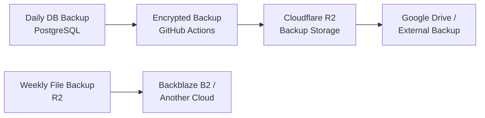

# Backup, Data Safety & Security

## Backup Strategy

- **Database**: backed up daily, encrypted, and copied to Cloudflare R2 and then to an external location (Google Drive) so a single provider outage can't destroy club data.
- **Files** (posters, resumes, submissions in R2): backed up weekly to a second cloud provider (Backblaze B2 or similar), so file storage also isn't single-point-of-failure.
- Backups run automatically via GitHub Actions — no manual step required, and no one needs to remember to "back things up" before a big event.

## Security Practices

| Practice | What it means in practice |
|---|---|
| **JWT Authentication** | Logins issue a signed token; the API verifies it on every request instead of trusting cookies alone. |
| **Role Based Access Control** | Every action checks "is this user allowed to do this?" before it happens. See [../features/role-based-access.md](../features/role-based-access.md). |
| **Data Encryption** | Sensitive data (backups, credentials) is encrypted at rest. |
| **Rate Limiting** | Prevents abuse — e.g. someone scripting thousands of fake registrations or login attempts. |
| **Audit Logs** | Every important admin action (publishing a form, changing a role, deleting a response) is logged with who/when/what. See [../features/audit-logs.md](../features/audit-logs.md). |
| **Regular Backups** | See above. |

## Why members should care

If a form response, blog post, or hackathon registration ever gets accidentally deleted or a server has an outage, the platform can be restored from a recent backup — club data (registrations, results, member records) is not at risk of permanent loss from routine failures.

## Related Docs
- [README.md](README.md) — architecture overview
- [../features/role-based-access.md](../features/role-based-access.md)
- [../features/audit-logs.md](../features/audit-logs.md)
