# Database Schema & Frontend Integration Mapping

This document provides a comprehensive, production-grade reference for the entire database architecture of the **SRKR Coding Club (SRKRCC) Platform**. It details every Django ORM model, column definitions, constraints, relationships, and exactly how and where each entity is utilized across the Next.js 15 frontend application.

---

## 1. Architectural Overview & Database Engine

- **Database Engine**: PostgreSQL (Production) / SQLite (Local development via `dj-database-url`)
- **ORM**: Django REST Framework (DRF) 3.15 + Django 5.x ORM
- **Base Model Pattern**: All primary business models inherit from `apps.core.models.TimeStampedModel`, ensuring consistent auto-updating `created_at` and `updated_at` audit timestamps.
- **Relational Integrity**: Strict Foreign Key cascading (`CASCADE`, `SET_NULL`), unique constraints (`slug`, `email`, `idempotency_key`), soft-delete mechanics (`FormField.is_deleted`), and JSONB/JSONField metadata indexing.

---

## 2. Complete Entity-Relationship Diagram (ERD)

```mermaid
erDiagram
    %% Core & Accounts
    USER ||--o{ RESPONSE : "submits"
    USER ||--o{ TEAM_LEADER : "leads"
    USER }o--o{ TEAM_MEMBER : "participates_in"
    USER ||--o{ CODEQUEST_SUBMISSION : "writes"
    USER ||--o| USER_STREAK : "tracks"
    USER ||--o{ BLOG_POST : "authors"
    USER ||--o{ AUDIT_LOG : "triggers"
    USER ||--o{ BULK_INGEST_SESSION : "initiates"
    USER ||--o{ MEMBER_NOTE : "receives_notes"
    USER ||--o{ ADMIN_MANUAL_RESPONSE : "overrides"

    %% Forms App
    FORM ||--o{ FORM_FIELD : "contains"
    FORM ||--o{ RESPONSE : "receives"
    FORM ||--o{ BULK_INGEST_SESSION : "ingests_into"
    RESPONSE ||--o{ ANSWER : "contains"
    FORM_FIELD ||--o{ ANSWER : "answers_for"

    %% Cross-App Form Linkages
    FORM ||--o{ EVENT : "registers_for"
    FORM ||--o{ HACKATHON : "registers_for"
    FORM ||--o{ JOB_LISTING : "applies_to"

    %% Hackathons App
    HACKATHON ||--o{ TEAM : "hosts"
    TEAM ||--o| HACKATHON_SUBMISSION : "submits"

    %% Codequest App
    PROBLEM ||--o{ CODEQUEST_SUBMISSION : "tests"

    %% Entity Details
    USER {
        int id PK
        string email UK
        string username
        string role "MEMBER|VOLUNTEER|JUDGE|CLUB_LEAD|ADMIN"
        string roll_number
        string branch
        int year
        string phone_number
        string github_profile
        string linkedin_profile
        datetime created_at
        datetime updated_at
    }

    FORM {
        int id PK
        string title
        string slug UK
        text description
        string image_url
        string category
        string status "DRAFT|PUBLISHED|CLOSED"
        int version
        bool allow_multiple_responses
        datetime allow_edits_until
        datetime open_at
        datetime close_at
        datetime created_at
        datetime updated_at
    }

    FORM_FIELD {
        int id PK
        int form_id FK
        string label
        string type "TEXT|EMAIL|NUMBER|DROPDOWN|RADIO|CHECKBOX|FILE|MATRIX_*|SIGNATURE|RATING..."
        string placeholder
        bool is_required
        json options
        json rows
        int min_value
        int max_value
        json conditional_logic
        json validation_rules
        int order
        bool is_deleted
        datetime created_at
        datetime updated_at
    }

    RESPONSE {
        int id PK
        int form_id FK
        int user_id FK "nullable"
        int form_version
        bool is_test_submission
        bool is_manual_entry
        int created_by_admin_id FK "nullable"
        datetime submitted_at
        datetime created_at
        datetime updated_at
    }

    ANSWER {
        int id PK
        int response_id FK
        int field_id FK
        json value
        datetime created_at
        datetime updated_at
    }

    BULK_INGEST_SESSION {
        int id PK
        int form_id FK
        string idempotency_key UK
        int created_by_id FK "nullable"
        int imported_count
        int skipped_count
        int duplicate_count
        json error_log
        string status "COMPLETED|PARTIAL|FAILED"
        datetime created_at
    }

    MEMBER_NOTE {
        int id PK
        int user_id FK
        text note
        int created_by_id FK "nullable"
        datetime created_at
    }

    EVENT {
        int id PK
        string title
        string slug UK
        text description
        string category
        string venue
        int capacity
        string poster_image
        datetime start_time
        datetime end_time
        datetime visible_from
        datetime visible_until
        int registration_form_id FK "nullable"
        datetime created_at
        datetime updated_at
    }

    HACKATHON {
        int id PK
        string title
        string slug UK
        bool is_flagship
        string theme
        text description
        string prize_pool
        string banner_image
        datetime start_date
        datetime end_date
        datetime visible_from
        datetime visible_until
        int registration_form_id FK "nullable"
        datetime created_at
        datetime updated_at
    }

    TEAM {
        int id PK
        int hackathon_id FK
        string name
        int leader_id FK
        datetime created_at
        datetime updated_at
    }

    HACKATHON_SUBMISSION {
        int id PK
        int team_id FK,UK
        string project_title
        text description
        string repo_url
        string demo_url
        string video_url
        float score
        datetime created_at
        datetime updated_at
    }

    PROBLEM {
        int id PK
        string title
        string slug UK
        string difficulty "EASY|MEDIUM|HARD"
        text statement
        text constraints
        text sample_input
        text sample_output
        json tags
        date scheduled_date UK
        datetime created_at
        datetime updated_at
    }

    CODEQUEST_SUBMISSION {
        int id PK
        int problem_id FK
        int user_id FK
        text code
        string language
        bool is_correct
        datetime created_at
        datetime updated_at
    }

    USER_STREAK {
        int id PK
        int user_id FK,UK
        int current_streak
        int max_streak
        date last_solved_date
        datetime created_at
        datetime updated_at
    }

    JOB_LISTING {
        int id PK
        string title
        string slug UK
        string company_name
        string job_type "INTERNSHIP|FULL_TIME|PART_TIME"
        string location
        string salary_range
        text description
        datetime deadline
        int application_form_id FK "nullable"
        datetime created_at
        datetime updated_at
    }

    BLOG_POST {
        int id PK
        string title
        string slug UK
        int author_id FK
        text content
        text excerpt
        string cover_image
        json tags
        bool is_published
        datetime published_at
        datetime created_at
        datetime updated_at
    }

    FEATURE_FLAG {
        int id PK
        string key UK
        string name
        text description
        bool is_enabled
        datetime created_at
        datetime updated_at
    }

    AUDIT_LOG {
        int id PK
        int actor_id FK "nullable"
        string action
        string target_model
        string target_id
        json details
        datetime created_at
        datetime updated_at
    }
```

---

## 3. Detailed App-by-App Database Schemas

### 3.1. Accounts Module (`apps/accounts/models.py`)

#### `User` (Table: `accounts_user`)
Extends `AbstractUser` and `TimeStampedModel`. Serves as the central authentication and authorization identity.
- `id` (`BigAutoField`, PK)
- `email` (`EmailField`, Unique, `USERNAME_FIELD`)
- `username` (`CharField`, max_length=150)
- `password` (`CharField`, Argon2/PBKDF2 hash)
- `role` (`CharField(20)`, choices: `MEMBER`, `VOLUNTEER`, `JUDGE`, `CLUB_LEAD`, `ADMIN`, default: `MEMBER`)
- `roll_number` (`CharField(50)`, nullable, blank)
- `branch` (`CharField(100)`, nullable, blank)
- `year` (`IntegerField`, nullable, blank)
- `phone_number` (`CharField(20)`, nullable, blank)
- `github_profile` (`URLField`, nullable, blank)
- `linkedin_profile` (`URLField`, nullable, blank)
- `is_active` (`BooleanField`, default: True)
- `is_staff` (`BooleanField`, default: False)
- `is_superuser` (`BooleanField`, default: False)
- `created_at`, `updated_at` (`DateTimeField`)

---

### 3.2. Dynamic Forms & Data Management (`apps/forms/models.py`)

#### `Form` (Table: `forms_form`)
Root entity for custom club forms and event questionnaires.
- `id` (`BigAutoField`, PK)
- `title` (`CharField(200)`)
- `slug` (`SlugField(200)`, Unique)
- `description` (`TextField`, blank)
- `image_url` (`URLField`, nullable, blank)
- `category` (`CharField(100)`, default: `'General'`)
- `status` (`CharField(20)`, choices: `DRAFT`, `PUBLISHED`, `CLOSED`, default: `DRAFT`)
- `version` (`PositiveIntegerField`, default: 1)
- `allow_multiple_responses` (`BooleanField`, default: False)
- `allow_edits_until` (`DateTimeField`, nullable, blank)
- `open_at` (`DateTimeField`, nullable, blank)
- `close_at` (`DateTimeField`, nullable, blank)

#### `FormField` (Table: `forms_formfield`)
Configurable form element definition with conditional routing logic.
- `id` (`BigAutoField`, PK)
- `form_id` (`ForeignKey -> Form`, `on_delete=CASCADE`, `related_name='fields'`)
- `label` (`CharField(255)`)
- `type` (`CharField(20)`, choices: `TEXT`, `PARAGRAPH`, `EMAIL`, `NUMBER`, `PHONE`, `URL`, `DROPDOWN`, `RADIO`, `CHECKBOX`, `FILE`, `MULTI_FILE`, `DATE`, `TIME`, `SECTION`, `RATING`, `LINEAR_SCALE`, `MATRIX_RADIO`, `MATRIX_CHECKBOX`, `SIGNATURE`)
- `placeholder` (`CharField(255)`, blank)
- `is_required` (`BooleanField`, default: False)
- `options` (`JSONField`, default: `list`, choice items)
- `rows` (`JSONField`, default: `list`, matrix row labels)
- `min_value` / `max_value` (`IntegerField`, nullable, rating/scale bounds)
- `conditional_logic` (`JSONField`, default: `dict`, multi-rule schema e.g. `{"logic": "AND", "rules": [{"if": 12, "operator": "equals", "value": "CSE"}]}`)
- `validation_rules` (`JSONField`, default: `dict`, e.g. `{"max_size_mb": 10, "allowed_extensions": ["pdf"]}`)
- `order` (`IntegerField`, default: 0)
- `is_deleted` (`BooleanField`, default: False, soft-delete preserving historical responses)

#### `Response` (Table: `forms_response`)
Submission transaction header.
- `id` (`BigAutoField`, PK)
- `form_id` (`ForeignKey -> Form`, `on_delete=CASCADE`, `related_name='responses'`)
- `user_id` (`ForeignKey -> User`, `on_delete=SET_NULL`, nullable, blank)
- `form_version` (`PositiveIntegerField`, default: 1)
- `is_test_submission` (`BooleanField`, default: False)
- `submitted_at` (`DateTimeField`, `auto_now_add=True`)
- `is_manual_entry` (`BooleanField`, default: False)
- `created_by_admin_id` (`ForeignKey -> User`, `on_delete=SET_NULL`, nullable, blank, `related_name='admin_manual_responses'`)

#### `Answer` (Table: `forms_answer`)
Normalized atomic response answer cell.
- `id` (`BigAutoField`, PK)
- `response_id` (`ForeignKey -> Response`, `on_delete=CASCADE`, `related_name='answers'`)
- `field_id` (`ForeignKey -> FormField`, `on_delete=CASCADE`)
- `value` (`JSONField`, nullable, blank; holds string, array of strings, or matrix row-column map)

#### `BulkIngestSession` (Table: `forms_bulkingestsession`)
Audit and idempotency log for CSV/Excel data ingestion pipelines.
- `id` (`BigAutoField`, PK)
- `form_id` (`ForeignKey -> Form`, `on_delete=CASCADE`, `related_name='ingest_sessions'`)
- `idempotency_key` (`CharField(64)`, Unique)
- `created_by_id` (`ForeignKey -> User`, `on_delete=SET_NULL`, nullable)
- `imported_count` (`PositiveIntegerField`, default: 0)
- `skipped_count` (`PositiveIntegerField`, default: 0)
- `duplicate_count` (`PositiveIntegerField`, default: 0)
- `error_log` (`JSONField`, default: `list`)
- `status` (`CharField(20)`, choices: `COMPLETED`, `PARTIAL`, `FAILED`, default: `COMPLETED`)
- `created_at` (`DateTimeField`, `auto_now_add=True`)

#### `MemberNote` (Table: `forms_membernote`)
Internal administrator notes attached to member profiles.
- `id` (`BigAutoField`, PK)
- `user_id` (`ForeignKey -> User`, `on_delete=CASCADE`, `related_name='admin_notes'`)
- `note` (`TextField`)
- `created_by_id` (`ForeignKey -> User`, `on_delete=SET_NULL`, nullable, `related_name='authored_notes'`)
- `created_at` (`DateTimeField`, `auto_now_add=True`)

---

### 3.3. Events Module (`apps/events/models.py`)

#### `Event` (Table: `events_event`)
- `id` (`BigAutoField`, PK)
- `title` (`CharField(200)`)
- `slug` (`SlugField(200)`, Unique)
- `description` (`TextField`)
- `category` (`CharField(100)`, default: `'Workshop'`)
- `venue` (`CharField(200)`, default: `'Campus Auditorium'`)
- `capacity` (`PositiveIntegerField`, default: 100)
- `poster_image` (`URLField`, nullable, blank)
- `start_time` / `end_time` (`DateTimeField`)
- `visible_from` / `visible_until` (`DateTimeField`, nullable, blank)
- `registration_form_id` (`ForeignKey -> forms.Form`, `on_delete=SET_NULL`, nullable, blank)

---

### 3.4. Hackathons & Competitions (`apps/hackathons/models.py`)

#### `Hackathon` (Table: `hackathons_hackathon`)
- `id` (`BigAutoField`, PK)
- `title` (`CharField(200)`)
- `slug` (`SlugField(200)`, Unique)
- `is_flagship` (`BooleanField`, default: False; IconCoders edition)
- `theme` (`CharField(255)`)
- `description` (`TextField`)
- `prize_pool` (`CharField(100)`, default: `'₹50,000'`)
- `banner_image` (`URLField`, nullable, blank)
- `start_date` / `end_date` (`DateTimeField`)
- `visible_from` / `visible_until` (`DateTimeField`, nullable, blank)
- `registration_form_id` (`ForeignKey -> forms.Form`, `on_delete=SET_NULL`, nullable, blank)

#### `Team` (Table: `hackathons_team`)
- `id` (`BigAutoField`, PK)
- `hackathon_id` (`ForeignKey -> Hackathon`, `on_delete=CASCADE`, `related_name='teams'`)
- `name` (`CharField(150)`)
- `leader_id` (`ForeignKey -> User`, `on_delete=CASCADE`, `related_name='led_teams'`)
- `members` (`ManyToManyField -> User`, `related_name='hackathon_teams'`, blank)

#### `Submission` (Table: `hackathons_submission`)
- `id` (`BigAutoField`, PK)
- `team_id` (`OneToOneField -> Team`, `on_delete=CASCADE`, `related_name='submission'`)
- `project_title` (`CharField(200)`)
- `description` (`TextField`)
- `repo_url` (`URLField`)
- `demo_url` / `video_url` (`URLField`, nullable, blank)
- `score` (`FloatField`, default: 0.0)

---

### 3.5. CodeQuest Daily Streak Engine (`apps/codequest/models.py`)

#### `Problem` (Table: `codequest_problem`)
- `id` (`BigAutoField`, PK)
- `title` (`CharField(200)`)
- `slug` (`SlugField(200)`, Unique)
- `difficulty` (`CharField(10)`, choices: `EASY`, `MEDIUM`, `HARD`, default: `EASY`)
- `statement` (`TextField`)
- `constraints` (`TextField`, blank)
- `sample_input` / `sample_output` (`TextField`, blank)
- `tags` (`JSONField`, default: `list`)
- `scheduled_date` (`DateField`, Unique; drives Daily Challenge publication)

#### `Submission` (Table: `codequest_submission`)
- `id` (`BigAutoField`, PK)
- `problem_id` (`ForeignKey -> Problem`, `on_delete=CASCADE`, `related_name='submissions'`)
- `user_id` (`ForeignKey -> User`, `on_delete=CASCADE`, `related_name='codequest_submissions'`)
- `code` (`TextField`)
- `language` (`CharField(50)`, default: `'python'`)
- `is_correct` (`BooleanField`, default: False)

#### `UserStreak` (Table: `codequest_userstreak`)
- `id` (`BigAutoField`, PK)
- `user_id` (`OneToOneField -> User`, `on_delete=CASCADE`, `related_name='streak'`)
- `current_streak` (`PositiveIntegerField`, default: 0)
- `max_streak` (`PositiveIntegerField`, default: 0)
- `last_solved_date` (`DateField`, nullable, blank)

---

### 3.6. Career Hub (`apps/career/models.py`)

#### `JobListing` (Table: `career_joblisting`)
- `id` (`BigAutoField`, PK)
- `title` (`CharField(200)`)
- `slug` (`SlugField(200)`, Unique)
- `company_name` (`CharField(150)`)
- `job_type` (`CharField(20)`, choices: `INTERNSHIP`, `FULL_TIME`, `PART_TIME`, default: `INTERNSHIP`)
- `location` (`CharField(150)`, default: `'Remote / On-site'`)
- `salary_range` (`CharField(100)`, blank)
- `description` (`TextField`)
- `deadline` (`DateTimeField`)
- `application_form_id` (`ForeignKey -> forms.Form`, `on_delete=SET_NULL`, nullable, blank)

---

### 3.7. Content Hub & Blogs (`apps/blogs/models.py`)

#### `BlogPost` (Table: `blogs_blogpost`)
- `id` (`BigAutoField`, PK)
- `title` (`CharField(200)`)
- `slug` (`SlugField(200)`, Unique)
- `author_id` (`ForeignKey -> User`, `on_delete=CASCADE`, `related_name='blog_posts'`)
- `content` (`TextField`)
- `excerpt` (`TextField`, blank)
- `cover_image` (`URLField`, nullable, blank)
- `tags` (`JSONField`, default: `list`)
- `is_published` (`BooleanField`, default: False)
- `published_at` (`DateTimeField`, nullable, blank)

---

### 3.8. Feature Flags & Auditing (`apps/feature_flags/`, `apps/audit/`)

#### `FeatureFlag` (Table: `feature_flags_featureflag`)
- `id` (`BigAutoField`, PK)
- `key` (`SlugField(50)`, Unique; e.g. `module_hackathons`, `module_codequest`, `module_forms`)
- `name` (`CharField(100)`)
- `description` (`TextField`, blank)
- `is_enabled` (`BooleanField`, default: True)

#### `AuditLog` (Table: `audit_auditlog`)
- `id` (`BigAutoField`, PK)
- `actor_id` (`ForeignKey -> User`, `on_delete=SET_NULL`, nullable, blank)
- `action` (`CharField(100)`)
- `target_model` (`CharField(100)`, blank)
- `target_id` (`CharField(100)`, blank)
- `details` (`JSONField`, default: `dict`)

---

## 4. Frontend Integration & Usage Mapping Matrix

The table below describes where and how backend database models map directly to Next.js 15 pages, components, hooks, and user interfaces:

| Backend Model | DRF Endpoint | Frontend Route (`src/app/`) | Frontend Component | UI Presentation & Interactivity |
| :--- | :--- | :--- | :--- | :--- |
| **`User`** | `/api/auth/users/` `/api/auth/register/` `/api/auth/login/` | `/admin` `/login` `/signup` `/profile` | `UsersTab.tsx` `CreateUserModal.tsx` `Navbar.tsx` | User management table, role modification (`MEMBER`, `VOLUNTEER`, `ADMIN`), user registration, JWT auth, user profile badges. |
| **`Form`** | `/api/forms/` `/api/forms/{slug}/` | `/forms` `/forms/[slug]` `/admin` | `FormBuilderTab.tsx` `FormsRegistryTab.tsx` `DataHealthTab.tsx` | Drag-and-drop schema designer, category tagging, status filtering (Published/Closed), publication window controls, version snapshots. |
| **`FormField`** | Nested in `/api/forms/{slug}/` `/api/forms/{slug}/fields/{id}/` | `/forms/[slug]` `/admin` | `FormBuilderTab.tsx` `CSVIngestionTab.tsx` | Dynamic form rendering (inputs, dropdowns, ratings, matrixes), conditional logic evaluation (`evaluate_visible_fields`), CSV column auto-matching. |
| **`Response`** | `/api/forms/{slug}/responses/` `/api/forms/submissions/` | `/admin` `/forms/[slug]` | `ResponsesViewerTab.tsx` `ResponseTimelineChart.tsx` `DetailDrawer.tsx` | Paginated responses table, submissions timeline chart (last 30 days), gap warning alerts for empty required fields, CSV export. |
| **`Answer`** | Nested in `Response` | `/admin` | `ResponsesViewerTab.tsx` `DetailDrawer.tsx` | Star ratings display (`★★★★☆`), signature canvas image render, uploaded file download links, JSON matrix table cells. |
| **`BulkIngestSession`** | `/api/forms/{slug}/bulk-ingest/` `/api/forms/data-health/` | `/admin` | `CSVIngestionTab.tsx` `DataHealthTab.tsx` | 4-step CSV wizard (Upload, Map, Validate, Ingest), chunked import progress bar, client-side error report generator, audit tracking. |
| **`MemberNote`** & Aggregated User Data | `/api/members/` | `/admin` | `MembersTab.tsx` `DetailDrawer.tsx` | Aggregated member submissions directory, form participation tag chips, GDPR JSON data export, admin note editor with persistence. |
| **`Event`** | `/api/events/` | `/` `/events` `/admin` | `UpcomingEventsGrid.tsx` `EventsHackathonsTab.tsx` | Home page event grid, venue/capacity indicators, direct "Register Now" redirect to linked `registration_form` slug. |
| **`Hackathon`** | `/api/hackathons/` | `/` `/hackathons` `/iconcoders` `/admin` | `PlatformModulesGrid.tsx` `EventsHackathonsTab.tsx` | Hackathon showcase, flagship IconCoders banners, prize pool callouts, countdown timers, linked registration forms. |
| **`Team`** & **`Submission`** (Hackathon) | `/api/hackathons/{id}/teams/` `/api/hackathons/{id}/submissions/` | `/hackathons` | `EventsHackathonsTab.tsx` | Team creation with leader + members multi-select, GitHub repo and demo video project submission, leaderboard score display. |
| **`Problem`** | `/api/codequest/daily/` `/api/codequest/` | `/codequest` `/admin` | `PlatformModulesGrid.tsx` | Daily CodeQuest puzzle display based on `scheduled_date`, difficulty badges (Easy, Medium, Hard), tags filter. |
| **`Submission`** & **`UserStreak`** (Codequest) | `/api/codequest/submit/` `/api/codequest/leaderboard/` | `/codequest` `/profile` | `StatsBar.tsx` | Live code submission tester, streak tracker counter (`current_streak`, `max_streak`), solved problem statistics. |
| **`JobListing`** | `/api/career/` | `/career` `/admin` | `ContentHubTab.tsx` | Internship and full-time hiring board, stipend badges, deadline alerts, linked custom application forms. |
| **`BlogPost`** | `/api/blogs/` | `/blogs` `/admin` | `ContentHubTab.tsx` | Student engineering blog articles, tag filtering, cover image banners, author attribution. |
| **`FeatureFlag`** | `/api/feature-flags/` | Everywhere | `FlagsTab.tsx` `PlatformModulesGrid.tsx` `Navbar.tsx` | Dynamic module access switches (enables/disables CodeQuest, Hackathons, Forms, etc. in realtime without redeployments). |
| **`AuditLog`** | `/api/audit/` | `/admin` | `AuditLogsTab.tsx` `DataHealthTab.tsx` | System mutation audit trail (flag toggles, bulk imports, schema updates, user role changes). |

---

## 5. Relational Query Optimization & Safeguards

1. **N+1 Query Prevention**:
   - `FormViewSet`: uses `.annotate(response_count=Count('responses', filter=Q(responses__is_test_submission=False)))`.
   - `Response` fetching: utilizes `.select_related('user', 'created_by_admin').prefetch_related('answers__field')`.
   - `MemberViewSet`: executes `Response.objects.filter(user__isnull=False).values('user').annotate(...)` to prevent null-grouping anomalies.
2. **Transaction Isolation**:
   - Multi-row CSV ingestion in `apps.forms.views.FormViewSet.bulk_ingest` operates under an outer `transaction.atomic()` with **per-row savepoints**, ensuring non-fatal row errors skip gracefully when `skip_errors=True`.
3. **JSONField String Search Compatibility**:
   - Email duplicate verification annotates JSONField answers using `Cast('value', output_field=TextField())` and matches against quoted JSON string values (`"student@srkr.ac.in"`), preventing zero-match queries across PostgreSQL versions.
4. **Soft-Delete Cascade Protection**:
   - `FormField.is_deleted=True` protects historical form submissions from losing field metadata when schema definitions are updated in the Drag-and-Drop Builder.
