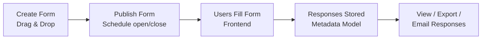

# Feature: Dynamic Form Builder

## What It Is
A drag-and-drop tool that lets an Admin or Club Lead **create any form** — event registration, hackathon sign-up, feedback survey, membership application — without writing code, and without a developer creating a new database table for it.

## Why It Exists
Every module on the platform (Events, Hackathons, Career, Membership) needs its own registration/application form, and those forms are never identical — a workshop might need just name + email, while a hackathon needs team details, track selection, and file uploads. Building each of these as custom code would be slow and would require a developer for every new form. The Dynamic Form Builder makes form creation a **content task**, not a **development task**. The technical trick that makes this possible — storing forms as data instead of database tables — is explained in [../architecture/data-model-dynamic-forms.md](../architecture/data-model-dynamic-forms.md).

## How It Works (Admin Side)

1. **Create** — Admin opens the form builder, drags in fields (see supported types below), sets labels, marks fields required/optional, adds validation rules.
2. **Configure Policies** — In Forms Registry:
   - **Submission Limits**: Choose whether students can submit multiple times or are restricted to 1 response per student.
   - **Response Editing**: Allow students to revisit the form and update their previously submitted answers.
   - **Auto-fill Student Profile**: When the limit is 1, enable automated profile matching (matching verified student Name, Email, Phone, Roll Number, Branch, Year, GitHub, and LinkedIn).
3. **Publish** — Admin schedules when the form opens/closes (or publishes immediately). See [scheduling.md](scheduling.md).
4. **Fill & Auto-match** — Authenticated members see their profile details pre-filled and submit the form.
5. **Store & Persist** — Every submission is saved as a "Response," with each answer linked to its field in PostgreSQL.
6. **View/Export/Email** — Admin can view responses in a table, export to CSV/Excel (see [data-export.md](data-export.md)), or trigger emails to everyone who responded (see [email-notifications.md](email-notifications.md)).

## Automation (Club ID + Confirmation Email)

Every form has an **Automation** section (in the builder, right under the title/description card) with two independent toggles:

- **Generate Club Member ID on submission** — pick which of this form's own fields
  supplies the submitter's email (required) and, optionally, name/phone/branch/roll
  number, plus a 2–6 letter Club ID prefix (default `SCC`). On each completed
  submission, the person is matched by that email against the club member
  directory: a new email gets a fresh, permanent, sequential Club ID (e.g.
  `26SCC001`); an email that's submitted before — on this form or any other
  Club-ID-enabled form — keeps the ID it already has. Safe under concurrent
  submissions: allocation is a row-locked counter, so two people finishing at the
  same instant can never receive the same ID. See
  [../architecture/data-model-dynamic-forms.md](../architecture/data-model-dynamic-forms.md#submission-time-automation-club-id--confirmation-email)
  for the technical detail.
- **Send confirmation email on submission** — pick an existing
  [Email Template](email-notifications.md) or draft a new one inline (subject,
  body, and which `{{placeholders}}` like `{{full_name}}`/`{{club_id}}` to use).
  The submitter receives it, personalized with their own answers, once their
  response is saved.

Field mapping needs a field's **permanent** ID, so a brand-new form must be saved
once before its fields can be mapped — the builder shows a hint and hides the
mapping controls until then.

## Supported Field Types
Text · Email · Phone · Number · Dropdown · Radio Button · Checkbox · Date · Time · File Upload · Multi File Upload · Paragraph · URL · Section (visual grouping) · Conditional Logic (show/hide a field based on a previous answer)

## Example: Building a Hackathon Registration Form
1. Admin adds fields: Team Name (Text), Team Size (Number), Track (Dropdown), Members' Details (Section with repeating Text fields), Resume (File Upload).
2. Admin adds a **Conditional Logic** rule: "if Team Size > 1, show 'Teammate 2' fields."
3. Admin schedules the form to open the day registrations begin and close automatically at the deadline.
4. Members fill it out from the Hackathon's registration page.
5. Admin exports all responses to Excel the morning of the event for check-in.

## Where It's Used
Every module with a sign-up/application: [Events](../modules/events.md), [Hackathons](../modules/hackathon.md), [IconCoders](../modules/iconcoders.md), [Career](../modules/career.md) (club-run drives), Membership applications.

## Related Docs
- [../architecture/data-model-dynamic-forms.md](../architecture/data-model-dynamic-forms.md) — how forms are stored technically
- [../admin/form-builder-admin.md](../admin/form-builder-admin.md) — step-by-step admin guide
- [scheduling.md](scheduling.md), [data-export.md](data-export.md), [email-notifications.md](email-notifications.md)
