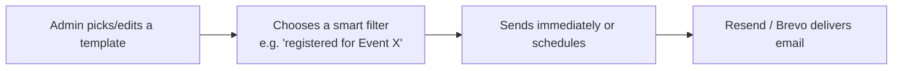

# Feature: Custom Email & Notifications

## What It Is
A templated email/notification system Admins use to send targeted messages — confirmations, reminders, results, announcements — to specific groups of users (everyone registered for an event, all Members, a single hackathon's teams, etc.), using **Resend/Brevo** as the sending service.

## Why It Exists
Manually emailing every registrant for every event would be unmanageable at any real scale, and generic mass-emails ("send to everyone") often aren't what's needed — a workshop reminder should go only to that workshop's registrants, not the whole club. This feature makes messaging **targeted, templated, and mostly automatic**.

## How It Works

1. **Templates** — reusable email layouts (confirmation, reminder, results, custom announcement) so admins don't rewrite emails from scratch each time.
2. **Smart filters** — target a specific audience: "everyone who registered for [Event]," "all Members," "this hackathon's Judges," etc.
3. **Send now or schedule** — tie into [Scheduling](scheduling.md) for reminders (e.g. "send 24 hours before event start").
4. **Automatic triggers** — some emails send without an admin clicking anything: registration confirmations, hackathon round updates, results notifications.

## Current Implementation

> The section above describes the target design. What's actually built and wired
> up today, precisely:

- **Sending**: Django's `EmailMultiAlternatives` (console backend in dev, SMTP in
  production per `EMAIL_BACKEND`/`EMAIL_HOST`) — not yet Resend/Brevo.
- **Templating**: `EmailTemplate` (`apps/core/models.py`) stores a subject +
  HTML/text body with `{{param}}` placeholders. Rendering
  (`EmailNotificationService.render_template`,
  `apps/core/services/email_service.py`) is a strict regex substitution against a
  parameter **whitelist** (`full_name`, `email`, `club_id`, `branch`, `portal_url`,
  `login_url`, `setup_password_url`, ...) — not a real template engine, so there's
  no code-execution surface even though admins draft the body freely.
- **Delivery tracking**: every send is an `EmailJob` (batch) with one
  `EmailDelivery` row per recipient (status, rendered subject, error message,
  timestamp) — this is the audit trail referenced below.
- **Dispatch**: `POST /api/auth/emails/send/` (`EmailDispatchView`,
  `apps/accounts/views_import.py`) accepts either an existing `template_id` or an
  inline `template_name` + `subject_template` + `message` (auto-creates a
  lightweight template on the fly). Runs off the request via Celery
  (`apps/core/tasks.py::process_email_job_task`) with a synchronous fallback —
  bounded to a few seconds even if the broker is unreachable
  (`try_dispatch_with_timeout`), so a down queue degrades gracefully instead of
  hanging the request.
- **Two triggers exist today**:
  1. **Member import welcome email** — `MemberImportService.commit_import`
     (CSV/XLSX backup import), optional per import.
  2. **Form submission confirmation** — `Form.confirmation_email_enabled` +
     `confirmation_email_template`, configured per-form in the
     [Form Builder's Automation section](dynamic-form-builder.md#automation-club-id--confirmation-email).
     See [../architecture/data-model-dynamic-forms.md](../architecture/data-model-dynamic-forms.md#submission-time-automation-club-id--confirmation-email).
- **Ad-hoc admin broadcast**: the [Data Management Center](../modules/dmc.md) lets
  an admin select rows in any dataset with an email column and send them a
  drafted-or-existing template directly — same `EmailDispatchView` endpoint, no
  separate send path.
- **Not yet built**: smart filters beyond "the rows I selected," scheduled sends,
  and the automatic hackathon-results/role-change/blog-alert triggers listed below
  — those remain the target design, not current behavior.

## Common Automatic Notifications

| Trigger | Email sent |
|---|---|
| Member submits a form with confirmation email enabled (any [Event](../modules/events.md)/[Hackathon](../modules/hackathon.md) registration form, if the admin turned it on — see Current Implementation above) | Confirmation email |
| [Scheduling](scheduling.md) reminder window reached | Reminder email |
| Hackathon results published | Results/winner notification |
| New [Career](../modules/career.md) listing posted | Alert to subscribed members |
| New [Blog](../modules/blogs.md) post published | Alert to subscribers |
| Role changed (see [Role Based Access](role-based-access.md)) | "Your role has been updated" notice |

## Related Docs
- [scheduling.md](scheduling.md) — powers timed reminders
- [../architecture/tech-stack.md](../architecture/tech-stack.md) — Resend/Brevo details
- [audit-logs.md](audit-logs.md) — bulk sends are logged
- [dynamic-form-builder.md](dynamic-form-builder.md) — configuring the per-form confirmation email
- [../modules/dmc.md](../modules/dmc.md) — the Data Management Center's ad-hoc bulk-send action
