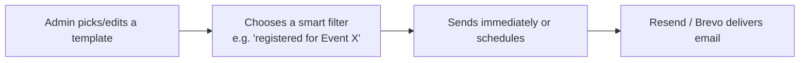

# Feature: Custom Email & Notifications

## What It Is
A templated email/notification system Admins use to send targeted messages — confirmations, reminders, results, announcements — to specific groups of users (everyone registered for an event, all Members, a single hackathon's teams, etc.), using **Resend/Brevo** as the sending service.

## Why It Exists
Manually emailing every registrant for every event would be unmanageable at any real scale, and generic mass-emails ("send to everyone") often aren't what's needed — a workshop reminder should go only to that workshop's registrants, not the whole club. This feature makes messaging **targeted, templated, and mostly automatic**.

## How It Works

1. **Templates** — reusable email layouts (confirmation, reminder, results, custom announcement) so admins don't rewrite emails from scratch each time.
2. **Smart filters** — target a specific audience: "everyone who registered for [Event]," "all Members," "this hackathon's Judges," etc.
3. **Send now or schedule** — tie into [Scheduling](scheduling.md) for reminders (e.g. "send 24 hours before event start").
4. **Automatic triggers** — some emails send without an admin clicking anything: registration confirmations, hackathon round updates, results notifications.

## Common Automatic Notifications

| Trigger | Email sent |
|---|---|
| Member registers for an [Event](../modules/events.md)/[Hackathon](../modules/hackathon.md) | Confirmation email |
| [Scheduling](scheduling.md) reminder window reached | Reminder email |
| Hackathon results published | Results/winner notification |
| New [Career](../modules/career.md) listing posted | Alert to subscribed members |
| New [Blog](../modules/blogs.md) post published | Alert to subscribers |
| Role changed (see [Role Based Access](role-based-access.md)) | "Your role has been updated" notice |

## Related Docs
- [scheduling.md](scheduling.md) — powers timed reminders
- [../architecture/tech-stack.md](../architecture/tech-stack.md) — Resend/Brevo details
- [audit-logs.md](audit-logs.md) — bulk sends are logged
