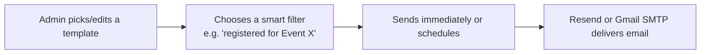

# Feature: Custom Email & Notifications

## What It Is
A templated email/notification system Admins use to send targeted messages — confirmations, reminders, results, announcements — to specific groups of users (everyone registered for an event, all Members, a single hackathon's teams, etc.), using **Resend/Brevo** as the sending service.

## Why It Exists
Manually emailing every registrant for every event would be unmanageable at any real scale, and generic mass-emails ("send to everyone") often aren't what's needed — a workshop reminder should go only to that workshop's registrants, not the whole club. This feature makes messaging **targeted, templated, and mostly automatic**.

## How It Works


```mermaid
flowchart LR
    A[Admin picks/edits a template] --> B[Chooses a smart filter\ne.g. 'registered for Event X']
    B --> C[Sends immediately or schedules]
    C --> D[Resend or Gmail SMTP delivers email]
```

1. **Templates** — reusable email layouts (confirmation, reminder, results, custom announcement) so admins don't rewrite emails from scratch each time.
2. **Smart filters** — target a specific audience: "everyone who registered for [Event]," "all Members," "this hackathon's Judges," etc.
3. **Send now or schedule** — tie into [Scheduling](scheduling.md) for reminders (e.g. "send 24 hours before event start").
4. **Automatic triggers** — some emails send without an admin clicking anything: registration confirmations, hackathon round updates, results notifications.

## Current Implementation

> The section above describes the target design. What's actually built and wired
> up today, precisely:

- **Sending**: Django's `EmailMultiAlternatives` through the provider chosen by
  `EMAIL_PROVIDER`: console in development, **Resend** on staging, **Gmail SMTP** in
  production. See [Email Providers](#email-providers) below.
- **Templating**: `EmailTemplate` (`apps/core/models.py`) stores a subject +
  HTML/text body with `{{param}}` placeholders. Rendering
  (`EmailNotificationService.render_template`,
  `apps/core/services/email_service.py`) is a strict regex substitution against a
  parameter **whitelist** (`full_name`, `email`, `club_id`, `branch`, `portal_url`,
  `login_url`, `setup_password_url`, ...) — not a real template engine, so there's
  no code-execution surface even though admins draft the body freely.
- **Delivery tracking**: every send is an `EmailJob` (batch) with one
  `EmailDelivery` row per recipient (status, rendered subject, error message,
  timestamp) — this is the audit trail referenced below.
- **Dispatch**: `POST /api/auth/emails/send/` (`EmailDispatchView`,
  `apps/accounts/views_import.py`) accepts either an existing `template_id` or an
  inline `template_name` + `subject_template` + `message` (auto-creates a
  lightweight template on the fly). Runs off the request via a plain background
  thread — `run_in_background(lambda: process_email_job(job.id))`
  (`apps/core/tasks.py`) — **not Celery**; there is no task queue, broker, or
  worker process in this app. The `EmailJob` row is created synchronously before
  the thread starts, so the job's status is always queryable even if the SMTP
  send is still in flight or the thread dies; there's no retry and the send
  itself won't survive a process restart mid-run.
- **Two triggers exist today**:
  1. **Member import welcome email** — `MemberImportService.commit_import`
     (CSV/XLSX backup import), optional per import.
  2. **Form submission confirmation** — `Form.confirmation_email_enabled` +
     `confirmation_email_template`, configured per-form in the
     [Form Builder's Automation section](dynamic-form-builder.md#automation-club-id--confirmation-email).
     See [../architecture/data-model-dynamic-forms.md](../architecture/data-model-dynamic-forms.md#submission-time-automation-club-id--confirmation-email).
- **Ad-hoc admin broadcast**: the [Data Management Center](../modules/dmc.md) lets
  an admin select rows in any dataset with an email column and send them a
  drafted-or-existing template directly — same `EmailDispatchView` endpoint, no
  separate send path.
- **Not yet built**: smart filters beyond "the rows I selected," scheduled sends,
  and the automatic hackathon-results/role-change/blog-alert triggers listed below
  — those remain the target design, not current behavior.

## Email Providers

`EMAIL_PROVIDER` decides who delivers mail. The choice is resolved in
`config/email_config.py` and exposed as the usual Django `EMAIL_*` settings, so every
send in the app (`EmailMultiAlternatives`, `send_mail`, the bulk email jobs) uses it
without any code change.

| `EMAIL_PROVIDER` | Used for | Delivery | Variables |
|---|---|---|---|
| `console` | local development (default when `DEBUG=True`) | printed to the terminal | none |
| `resend` | staging | Resend HTTPS API (`apps/core/email_backends.py`) | `RESEND_API_KEY`, `DEFAULT_FROM_EMAIL` |
| `gmail` | production (default when `DEBUG=False`) | Gmail SMTP, `smtp.gmail.com:587` with TLS | `EMAIL_HOST_USER`, `EMAIL_HOST_PASSWORD`, `DEFAULT_FROM_EMAIL` |

Every provider also reads `FRONTEND_URL`, the public address of the frontend that
links inside emails (password setup, form confirmations, hackathon invites) are built
from. It defaults to `http://localhost:3000`, so it must be set on staging and production.
A value other than the three above stops the app at startup with an error listing the valid ones.

The old `EMAIL_BACKEND`, `EMAIL_HOST`, `EMAIL_PORT` and `EMAIL_USE_TLS` variables are no
longer read. Templates for each environment live in `.env.example` (local),
`.env.staging.example` and `.env.production.example`.

**Resend (staging)**
- Sends over HTTPS, so it works on hosts that block outbound SMTP. Standard library only, no extra dependency.
- Resend limits each team to 2 requests per second. The backend spaces sends about 0.6 seconds apart and retries a rate-limited request (up to 3 times, honouring `Retry-After`), so a bulk job runs at roughly 1.5 emails per second.
- Failures raise `ResendError` with Resend's reason. The API key is never included in an error message, an audit entry or a delivery record.
- The sender must be on a domain verified at resend.com/domains. Until then use the sandbox sender `onboarding@resend.dev`, which can only deliver to the email address that owns the Resend account. Free-mailbox senders such as `@gmail.com` are rejected.

**Gmail SMTP (production)**
- Use a Google **app password** (turn on 2-Step Verification, then create one at myaccount.google.com/apppasswords). The normal account password does not work. The spaces Google displays in it are ignored.
- Gmail replaces the From address with `EMAIL_HOST_USER` unless the sender is a verified "Send mail as" alias, so set `DEFAULT_FROM_EMAIL` to the same address.
- Gmail caps sending at about 500 recipients per day on a free account and 2,000 on Google Workspace, which matters for large announcement emails.
- It needs outbound access to port 587. Some hosts block SMTP, so confirm the production host allows it before relying on this.
- Connections time out after 20 seconds so a stalled send cannot pin a web worker.

**Startup checks.** `python manage.py check` reports misconfiguration instead of letting sends fail silently: `core.W001` Resend without an API key, `core.W002` Resend with a free-mailbox sender, `core.W003` Gmail without credentials, `core.W004` the console provider outside development, `core.W005` a real provider with a localhost `FRONTEND_URL`, and the informational `core.I001` when Gmail's From address differs from the account.

**Trying a provider.** From a shell with the environment loaded:

```
python manage.py shell -c "from django.core.mail import send_mail; print(send_mail('Test', 'It works.', None, ['you@example.com']))"
```

It prints `1` when the provider accepted the message.

## Hackathon Announcement Emails
A hackathon announcement created with **Also email the audience** (or re-sent with `POST /api/hackathons/{slug}/announcements/{id}/notify/`) is emailed to every user in its audience through the same `EmailJob` / `EmailDelivery` engine (`AnnouncementService.notify` in `apps/hackathons/services.py`). Because the background job rebuilds each recipient's context from their profile, the announcement text is baked into a dedicated template named `hackathon_announcement_<id>` (only `first_name` and `portal_url` are parameters; `{{` / `}}` typed by the admin are neutralised). Dispatch happens after the transaction commits, on the `run_in_background` daemon thread. Publishing a round's results with `email: true` uses the same path for its shortlisted-teams announcement.

**Team invites** send a single direct email to the invitee (`send_invite_email` in `apps/hackathons/services.py`, via `EmailNotificationService.send_email`) after the invite commits, also on a background thread. These are not tracked as `EmailJob`s; a send failure is logged and never affects the invite.

## Common Automatic Notifications

| Trigger | Email sent |
|---|---|
| Member submits a form with confirmation email enabled (any [Event](../modules/events.md)/[Hackathon](../modules/hackathon.md) registration form, if the admin turned it on — see Current Implementation above) | Confirmation email |
| [Scheduling](scheduling.md) reminder window reached | Reminder email |
| Hackathon results published | Results/winner notification |
| New [Career](../modules/career.md) listing posted | Alert to subscribed members |
| New [Blog](../modules/blogs.md) post published | Alert to subscribers |
| Role changed (see [Role Based Access](role-based-access.md)) | "Your role has been updated" notice |

## Related Docs
- [scheduling.md](scheduling.md) — powers timed reminders
- [../architecture/tech-stack.md](../architecture/tech-stack.md) — Resend/Brevo details
- [audit-logs.md](audit-logs.md) — bulk sends are logged
- [dynamic-form-builder.md](dynamic-form-builder.md) — configuring the per-form confirmation email
- [../modules/dmc.md](../modules/dmc.md) — the Data Management Center's ad-hoc bulk-send action
