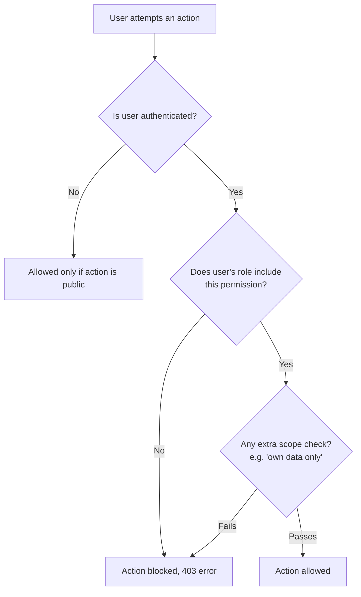

# Feature: Role Based Access (RBAC)

## What It Is
A system of **roles** (Public, Member, Volunteer, Club Lead, Admin, plus context-specific roles like Judge or Contributor) that determines exactly what each person can see and do on the platform.

## Why It Exists
Not everyone should be able to do everything — a Volunteer helping with event check-in shouldn't be able to delete a form or change someone else's role; a Member shouldn't see another member's private application data. RBAC keeps the platform safe and organized as the club grows, without needing to hand-code permission checks for every new feature.

## The Roles

| Role | Typical Scope | Can generally do |
|---|---|---|
| **Public / Visitor** | Not logged in | View public pages (Home, Blog, published Events/Hackathons listings) |
| **Member** | Logged-in student | Everything Public can, plus register for events/hackathons, submit Codequest solutions, apply to Career listings, view "My" pages |
| **Contributor** | Member with writing rights | Everything Member can, plus draft Blog posts for review |
| **Judge** | Assigned per hackathon | View team submissions and scoring criteria for that hackathon; submit scores |
| **Volunteer** | Assigned by Admin | View-only access to attendee/registration lists for events they're helping run; mark attendance |
| **Club Lead** | Elected/appointed club leadership | Create/edit content in their area (events, hackathons, blog, career listings, forms); view analytics; cannot manage other users' roles |
| **Admin** | Platform owners/core team | Everything — including feature flags, role assignments, audit logs, and platform-wide settings |

## How Permissions Are Checked

Permissions aren't just "yes/no by role" — some are **scoped**. Example: a Club Lead can edit events *they created or are assigned to*, but not necessarily every event on the platform, depending on how the club configures it.

## Example: Who Can See a Hackathon's Registrations?
- **Public/Member**: cannot see the list at all.
- **Volunteer** (assigned to that hackathon): can view the list, check people in, cannot export or delete.
- **Judge**: sees only submissions, not personal registration details.
- **Club Lead**: full view + export for hackathons they organize.
- **Admin**: full view + export for every hackathon on the platform.

## Where It's Used
Every module — this is a cross-cutting feature, not tied to one page. See each module doc's "Roles Involved" section, e.g. [../modules/hackathon.md](../modules/hackathon.md#roles-involved).

## Related Docs
- [../architecture/backup-security.md](../architecture/backup-security.md)
- [../admin/user-role-management.md](../admin/user-role-management.md) — how Admins assign roles
- [audit-logs.md](audit-logs.md) — every permission-sensitive action is logged
