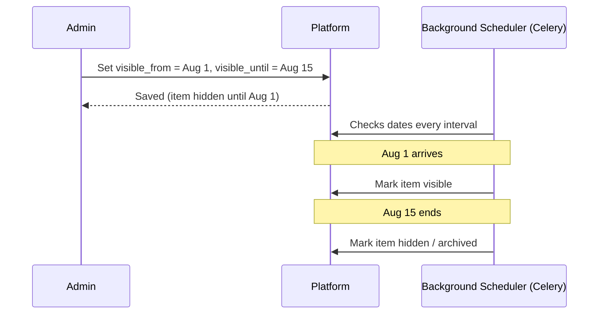

# Feature: Scheduling

## What It Is
The engine that lets Admins set a **start and/or end date/time** on forms, events, hackathons, blog posts, and Codequest problems — so the platform automatically publishes and unpublishes content without anyone having to click a button at the exact right moment.

## Why It Exists
Club activity is time-bound: registrations open and close, workshops happen on a specific day, a new coding problem should appear at midnight, results should publish the moment judging ends — often outside of when an admin is actively at their laptop. Scheduling removes the need for someone to manually babysit a clock.

## How It Works
Scheduling is powered by **Celery** (background job runner) checking against **Redis** on a regular interval (see [../architecture/tech-stack.md](../architecture/tech-stack.md)). When an admin sets a `visible_from` / `visible_until` (or `open_at` / `close_at`) on something, a background job checks these timestamps and flips the item's visibility state automatically when the time arrives — no page reload or manual admin action needed.

## What Can Be Scheduled

| Item | Scheduled behavior |
|---|---|
| A [Feature Flag](feature-flags.md) item window | Auto-show/hide an event, hackathon, or listing by date |
| A [Dynamic Form](dynamic-form-builder.md) | Auto-open at a start time, auto-close at a deadline |
| A [Blog](../modules/blogs.md) post | Auto-publish at a scheduled future date/time |
| A [Codequest](../modules/codequest.md) problem | Auto-publish as "today's problem" at midnight on its assigned date |
| Email/notification sends | Send reminders X hours/days before an event (see [email-notifications.md](email-notifications.md)) |

## Related Docs
- [feature-flags.md](feature-flags.md) — the visibility system this powers
- [../architecture/tech-stack.md](../architecture/tech-stack.md) — Celery/Redis details
- [email-notifications.md](email-notifications.md) — scheduled reminders
