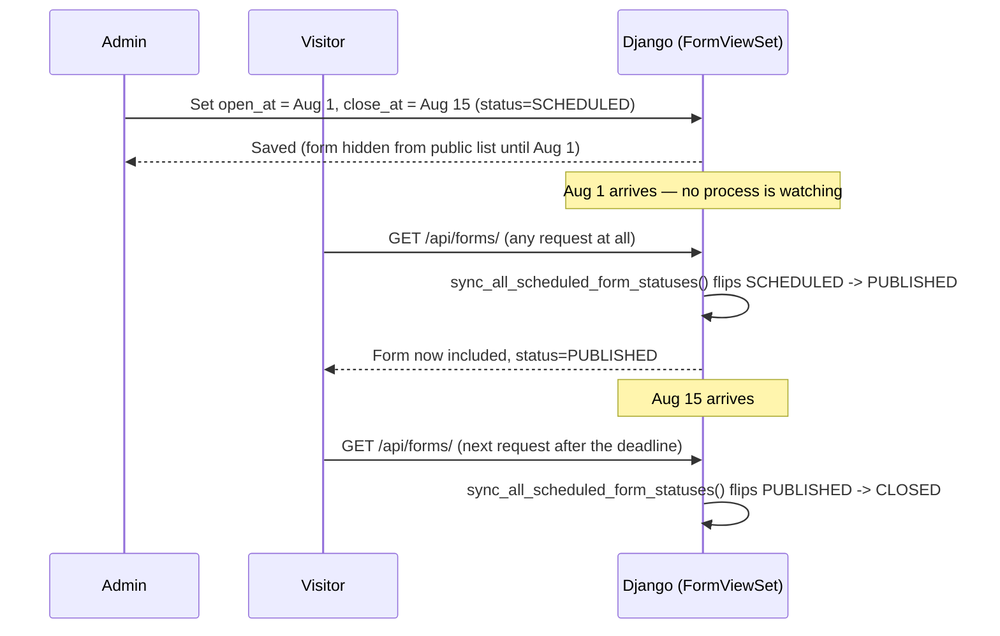

# Feature: Scheduling

## What It Is
The engine that lets Admins set a **start and/or end date/time** so content publishes or closes itself without anyone having to click a button at the exact right moment. **Currently working for Dynamic Forms and Codequest problems only** — see the table below for what's real vs. still-aspirational for events, hackathons, blog posts, and feature flags.

## Why It Exists
Club activity is time-bound: registrations open and close, workshops happen on a specific day, a new coding problem should appear at midnight, results should publish the moment judging ends — often outside of when an admin is actively at their laptop. Scheduling removes the need for someone to manually babysit a clock.

## How It Works

> **Current implementation — read this before the diagram below.** There is
> no background scheduler, Celery beat, or cron polling Redis on an interval.
> Scheduling is **lazy, on-read**: `sync_all_scheduled_form_statuses()`
> (`apps/forms/models.py`) runs synchronously at the top of `FormViewSet.get_queryset()`
> — i.e. every time anyone lists or fetches forms — and bulk-updates any
> `SCHEDULED`/`PUBLISHED` form whose `open_at`/`close_at` has passed relative
> to `timezone.now()`. A form's status only actually flips the next time
> something queries the forms table; there is no process running between
> requests. In practice this is invisible to users (forms are read constantly),
> but a form with zero reads between its open/close time and the next one
> would show its old status until the next read. The table below describes
> the target behavior; the mechanism achieving it today is this lazy sync, not
> a live background scheduler.

## What Can Be Scheduled

| Item | Documented behavior | Actually implemented? |
|---|---|---|
| A [Dynamic Form](dynamic-form-builder.md) | Auto-open at `open_at`, auto-close at `close_at` | **Yes** — lazy sync described above (`sync_all_scheduled_form_statuses`, `apps/forms/models.py`) |
| A [Codequest](../modules/codequest.md) problem | Appears as "today's problem" on its `scheduled_date` | **Yes**, and more simply than forms: `ProblemViewSet.get_queryset()` (`apps/codequest/views.py`) just filters `scheduled_date__lte=today` on every read — there's no status field to flip, so there's nothing to go stale. |
| An [Event](../modules/events.md) / [Hackathon](../modules/hackathon.md) visibility window | Auto-show/hide by `visible_from`/`visible_until` | **No.** Both models have these columns (`apps/events/models.py`, `apps/hackathons/models.py`) and `Event`'s serializer exposes them as editable — but no view, queryset, or serializer on either app ever reads them to filter what's shown. An admin can set `visible_until` in the past and the item stays fully visible. Dead fields today; a real gap if anyone is relying on this. |
| A [Feature Flag](feature-flags.md) | Auto-show/hide a module by date window | **No.** `FeatureFlag` (`apps/feature_flags/models.py`) is a plain `is_enabled` boolean with no date fields at all — flags are toggled manually, not scheduled. |
| A [Blog](../modules/blogs.md) post | Auto-publish at a scheduled future date/time | **No.** No scheduling field exists anywhere in `apps/blogs/models.py`; posts are visible as soon as created. |
| Email/notification reminders | Send X hours/days before an event | **No** — see [email-notifications.md](email-notifications.md)'s "Current Implementation" section; only immediate sends exist today. |

## Related Docs
- [feature-flags.md](feature-flags.md) — the (manual, not scheduled) module visibility system
- [../architecture/tech-stack.md](../architecture/tech-stack.md#background-jobs--caching-current-state) — why there's no Celery/Redis behind any of this
- [email-notifications.md](email-notifications.md) — scheduled reminders (not yet built)
