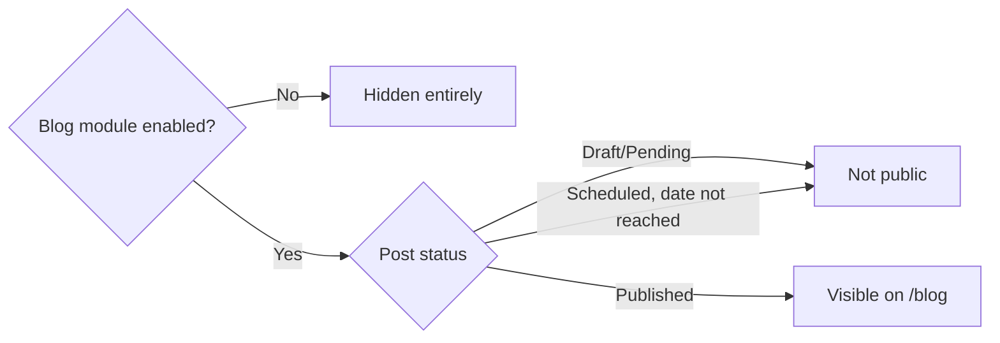
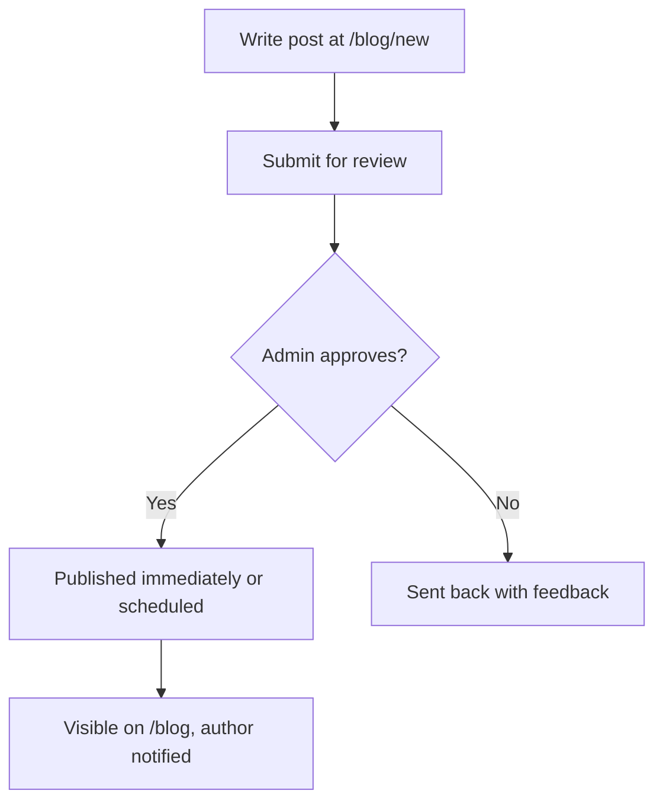

# Module: Blog

## Overview
The Blog module lets the club (and, with permission, individual members) publish articles — event recaps, tutorials, member spotlights, tech write-ups. It's the club's public voice and a place for members to build a writing/portfolio presence.

## Who It's For
Readers (everyone), writers (members with publishing permission), and Admins/Club Leads who moderate.

## Public Pages

| Page | Path (example) | What it shows | Visible to |
|---|---|---|---|
| Blog listing | `/blog` | All published posts, filterable by tag/author | Everyone |
| Post details | `/blog/[slug]` | Full article, author byline, related posts, comments (if enabled) | Everyone |
| Author profile | `/blog/author/[username]` | All posts by one author | Everyone |
| Write/submit post | `/blog/new` | Editor for members with writing permission to draft a post | Members with "Contributor" role |

## Admin Pages

| Page | Path (example) | What it does | Who can access |
|---|---|---|---|
| Post moderation queue | `/admin/blog/pending` | Review/approve/reject member-submitted drafts before they go live | Admin, Club Lead |
| Post manager | `/admin/blog/posts` | Edit/unpublish/feature any post | Admin, Club Lead |
| Category/tag manager | `/admin/blog/tags` | Organize taxonomy | Admin, Club Lead |

## Visibility Rules
- The **Blog module** can be hidden entirely via its feature flag.
- **Individual posts** are visible only once published (drafts and pending-review posts are never public).
- Posts can optionally be **scheduled** for a future publish date/time — they stay hidden until then, then go live automatically. See [Scheduling](../features/scheduling.md).

## User Flow (Contributor)

## Key Features Used
- [Feature Flags](../features/feature-flags.md) — module-level visibility
- [Scheduling](../features/scheduling.md) — scheduled publishing
- [File & Image Management](../features/file-image-management.md) — cover images, embedded media
- [Role Based Access](../features/role-based-access.md) — Contributor vs Admin publishing rights
- [Custom Email & Notifications](../features/email-notifications.md) — new post alerts to subscribers
- [Analytics & Insights](../features/analytics-insights.md) — post views/engagement

## Data Captured
Post content, author, tags, publish status/date, view counts.

## Roles Involved
Reader (public), Contributor (member who can draft), Club Lead/Admin (moderator/publisher).

## Related Docs
- [../admin/content-management.md](../admin/content-management.md)
