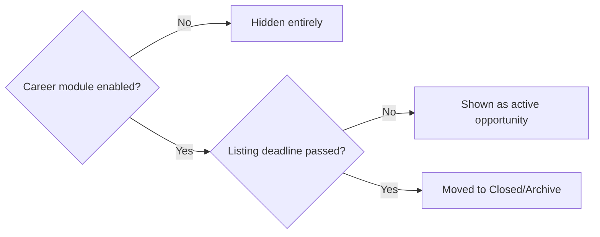
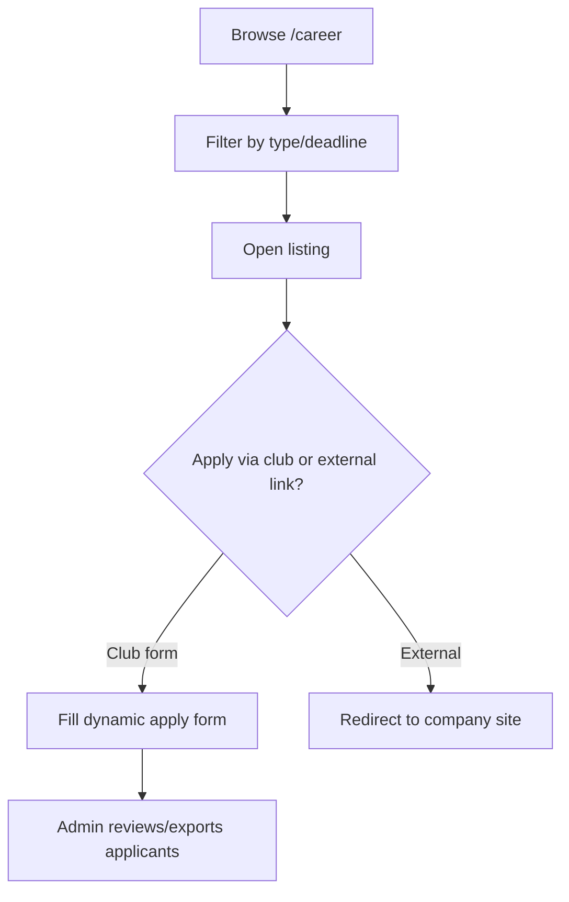

# Module: Career

## Overview
The Career module surfaces job/internship opportunities, placement resources, and interview-prep material curated by the club — a bridge between members and career opportunities (internships, off-campus drives, resume reviews, mock interviews organized by the club).

## Who It's For
Members (especially pre-final/final year) looking for internships/jobs, and Admins/Club Leads who curate listings and career-focused events.

## Public Pages

| Page | Path (example) | What it shows | Visible to |
|---|---|---|---|
| Career hub | `/career` | Listing of opportunities (internships, jobs, off-campus drives), filterable by type/company/deadline | Everyone (some listings may be member-only) |
| Opportunity details | `/career/[slug]` | Full description, eligibility, application link/deadline | Everyone / Members, per listing setting |
| Resources | `/career/resources` | Resume templates, interview prep guides, links | Members |
| Apply/Interest form | `/career/[slug]/apply` (if the club runs its own drive) | Dynamic form for applying through the club (vs external link) | Logged-in members |

## Admin Pages

| Page | Path (example) | What it does | Who can access |
|---|---|---|---|
| Opportunity manager | `/admin/career/listings` | Add/edit/remove job & internship listings, set deadlines and visibility | Admin, Club Lead |
| Resource library manager | `/admin/career/resources` | Upload/organize resume templates, guides | Admin, Club Lead |
| Applicant tracker | `/admin/career/[slug]/applicants` | View/export applicants for club-run drives | Admin, Club Lead |

## Visibility Rules (Feature Flag + Deadline-Based)
- The **Career module** as a whole can be shown/hidden via its feature flag.
- Individual **listings automatically hide once their application deadline passes** (or move to a "closed opportunities" archive rather than disappearing outright, depending on admin setting) — so members never see stale "apply now" buttons for expired opportunities.

## User Flow

## Key Features Used
- [Dynamic Form Builder](../features/dynamic-form-builder.md) — for club-run application drives
- [Feature Flags](../features/feature-flags.md) — module + deadline-based visibility
- [Scheduling](../features/scheduling.md) — auto-close past-deadline listings
- [Custom Email & Notifications](../features/email-notifications.md) — new opportunity alerts
- [Data Export](../features/data-export.md) — applicant lists
- [File & Image Management](../features/file-image-management.md) — resumes, resource PDFs

## Data Captured
Listing details (company, role, deadline, eligibility), applicant details/resumes for club-run drives.

## Roles Involved
Member (applicant), Club Lead/Admin (curator).

## Related Docs
- [../admin/content-management.md](../admin/content-management.md)
