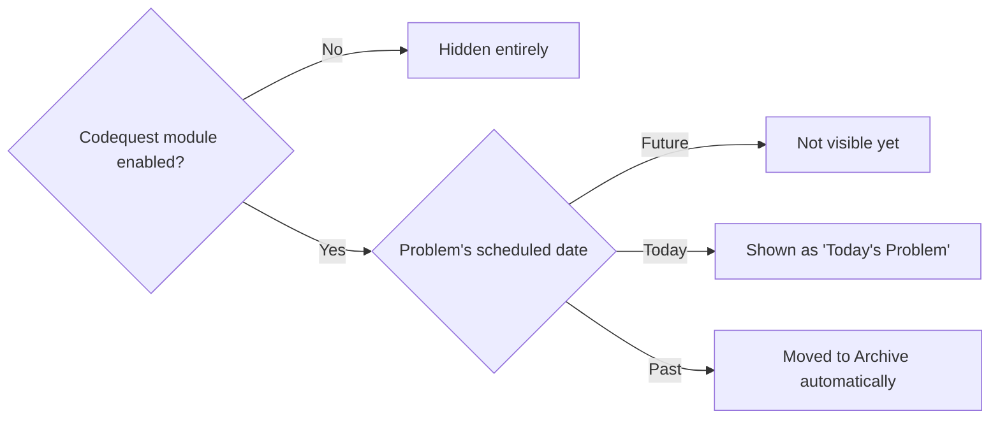
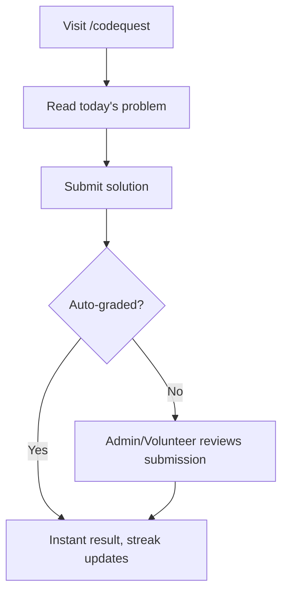

# Module: Codequest (Daily Problem of the Day)

## Overview
Codequest is the club's recurring "Problem of the Day" module (shown as **Daily Problems** in the platform's module map). A new coding problem is published automatically every day; members solve it, submit their answer/approach, and can track their streaks. It's the one module where **content publishes itself on a schedule**, rather than an admin manually posting each day.

## Who It's For
Members who want daily practice, and Admins/Club Leads who curate the problem bank.

## Public Pages

| Page | Path (example) | What it shows | Visible to |
|---|---|---|---|
| Today's Problem | `/codequest` | Current day's problem statement, difficulty, tags | Everyone |
| Archive | `/codequest/archive` | Past problems (browsable once their "current day" has passed) | Everyone |
| Submit solution | `/codequest/[date]/submit` | Submission form (code/answer, language, notes) | Logged-in members |
| Leaderboard / Streaks | `/codequest/leaderboard` | Who's solved the most, current streaks | Everyone |
| My submissions | `/codequest/my` | A member's own history and stats | Logged-in members |

## Admin Pages

| Page | Path (example) | What it does | Who can access |
|---|---|---|---|
| Problem bank | `/admin/codequest/problems` | Add/edit problems, tag difficulty/topic | Admin, Club Lead |
| Schedule manager | `/admin/codequest/schedule` | Queue problems to specific future dates — the system auto-publishes at midnight | Admin, Club Lead |
| Submission review | `/admin/codequest/submissions` | Review/verify submissions (for problems needing manual check, not just auto-graded ones) | Admin, Club Lead, Volunteer |

## Visibility Rules (Feature Flag + Date-Based Publishing)
This module uses date-based logic differently from Events/Hackathons — instead of a whole page hiding, **individual problems publish and unpublish themselves daily**:

- Only **today's problem** (by server date) is shown on `/codequest`.
- Problems scheduled for future dates stay invisible (even to admins browsing publicly) until their date arrives.
- Once a problem's day passes, it automatically moves to `/codequest/archive` — still viewable, but no longer "today's problem."
- The entire Codequest module can still be hidden from the sidebar via the module-level feature flag (e.g. during exam season).

## User Flow

## Key Features Used
- [Scheduling](../features/scheduling.md) — the core mechanic of this module; auto-publish/unpublish by date
- [Feature Flags](../features/feature-flags.md) — module-level hide/show
- [Analytics & Insights](../features/analytics-insights.md) — leaderboard, streaks, engagement
- [Data Export](../features/data-export.md) — exporting submission data

## Data Captured
Problem metadata (difficulty, tags), member submissions (code/text, timestamp, correctness), streak counters.

## Roles Involved
Member (solver), Club Lead/Admin (problem curator), Volunteer (submission reviewer).

## Related Docs
- [../features/scheduling.md](../features/scheduling.md)
- [../admin/content-management.md](../admin/content-management.md)
