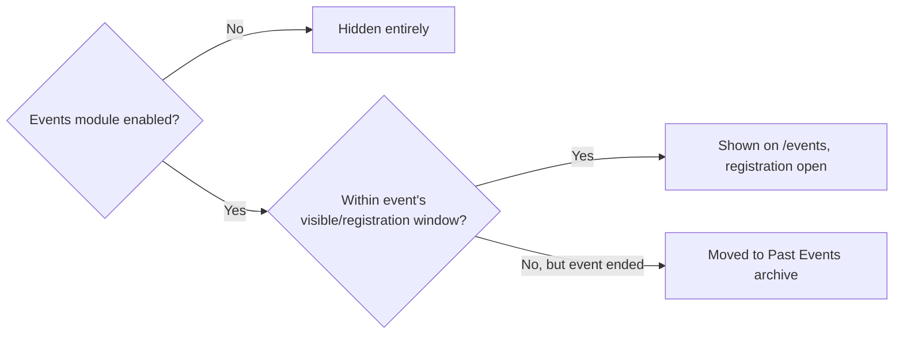
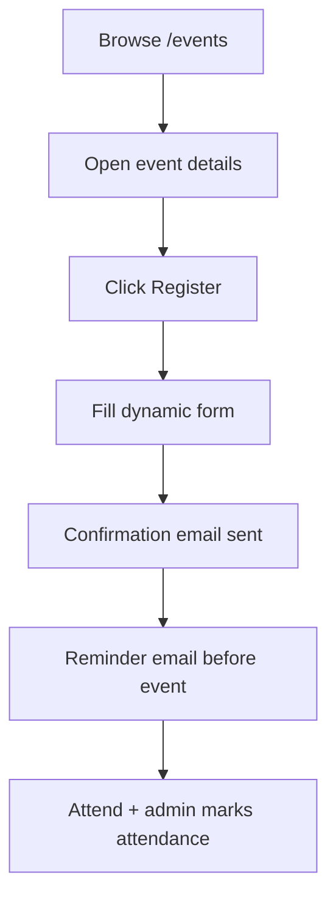

# Module: Events

## Overview
The Events module covers everything that *isn't* a hackathon — workshops, seminars, guest talks, meetups, coding contests, orientation sessions. It's the general-purpose "something is happening, come register" engine for the club.

## Who It's For
Members who want to attend, and Club Leads/Admins who organize.

## Public Pages

| Page | Path (example) | What it shows | Visible to |
|---|---|---|---|
| Events listing | `/events` | All events (no server-side date filtering — `EventViewSet` returns `Event.objects.all()` unfiltered; see the Visibility Rules gap note below), filterable by category | Everyone |
| Event details | `/events/[slug]` | Description, date/time/venue (or online link), speaker info, registration button | Everyone |
| Registration form | `/events/[slug]/register` | Dynamic form (varies per event — could be as simple as name+email, or detailed) | Logged-in members (or public, if event is open) |
| My registrations | `/events/my` | List of events a member has registered for, with reminders | Logged-in members |

## Admin Pages

| Page | Path (example) | What it does | Who can access |
|---|---|---|---|
| Event manager | `/admin/events` | Create/edit events: title, date/time, venue, capacity, visibility window | Admin, Club Lead |
| Registration form builder | `/admin/events/[slug]/form` | Build the registration form via [Dynamic Form Builder](../features/dynamic-form-builder.md) | Admin, Club Lead |
| Attendee list | `/admin/events/[slug]/attendees` | View/export registrants, mark attendance, send reminders | Admin, Club Lead, Volunteer |

## Visibility Rules (Feature Flag + Event Dates)
1. **Module-level flag** can hide "Events" from the sidebar entirely — this part is real (see [Feature Flags](../features/feature-flags.md)).
2. **Per-event date window — not implemented.** `Event` does have `visible_from`/`visible_until` columns and they're editable via the API, but `EventViewSet.get_queryset()` (`apps/events/views.py`) is just `Event.objects.all()` — no date filtering at all. A past event does not automatically drop off `/events`; nothing currently archives it server-side. See [Scheduling](../features/scheduling.md) for the full per-item breakdown across modules.

## User Flow

## Key Features Used
- [Dynamic Form Builder](../features/dynamic-form-builder.md)
- [Feature Flags](../features/feature-flags.md) — module + date-based visibility
- [Scheduling](../features/scheduling.md) — auto-archive past events, reminder timing
- [Custom Email & Notifications](../features/email-notifications.md) — confirmations, reminders
- [Data Export](../features/data-export.md) — attendee lists for check-in
- [Analytics & Insights](../features/analytics-insights.md) — attendance/engagement stats

## Data Captured
Attendee name, contact, college/branch/year (or custom fields per event), attendance status.

## Roles Involved
Member (attendee), Club Lead/Admin (organizer), Volunteer (check-in support).

## Related Docs
- [../admin/event-hackathon-management.md](../admin/event-hackathon-management.md)
- [hackathon.md](hackathon.md) — for hackathon-specific events, use that module instead
