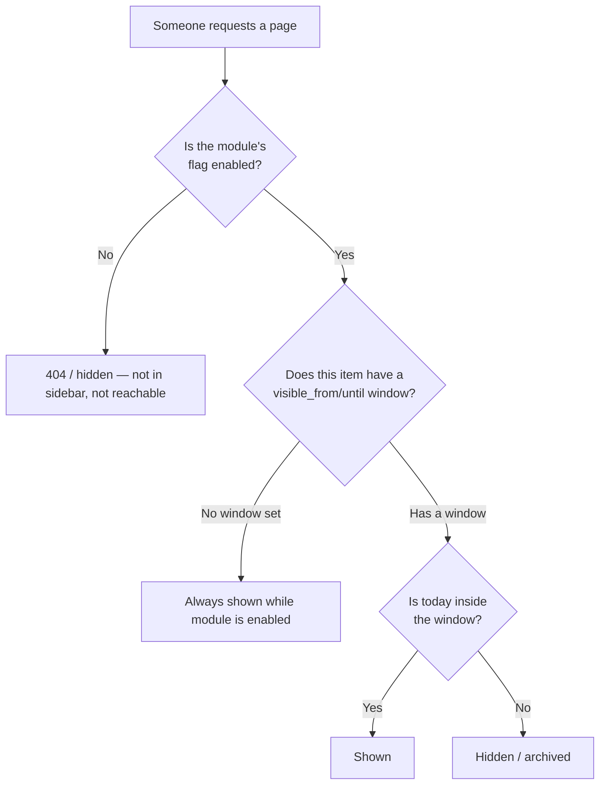

# Feature: Feature Flags

## What It Is
A **feature flag** is an on/off switch for a whole module (Home, Events, Hackathons, CodeFest, Codequest, Career, Membership, Resources, Community, Blog) that an admin controls from the Admin Panel — with **no code deployment required**. Flip it off, and that module vanishes from the sidebar and becomes unreachable for regular users; flip it on, and it reappears instantly.

## Why It Exists
Clubs run in seasons. Hackathons aren't happening year-round; Career drives cluster around placement season; some modules might be built but not ready to announce yet. Without feature flags, "hiding" a module would mean asking a developer to comment out code and redeploy — slow, risky, and a bottleneck on one person. With feature flags, any Admin or Club Lead can control platform visibility in seconds.

## Two Layers of Visibility

Feature flags control the platform at **two levels**, which work together:

### 1. Module-level flag (manual, admin-controlled)
A simple on/off switch per module. Example: Admin turns "Hackathons" **off** in the off-season → the module disappears from the sidebar entirely for all users (except Admins, who can still see it greyed-out in the admin panel).

### 2. Item-level, date-based visibility (automatic)
Within an *enabled* module, individual items (a specific event, a specific hackathon, a specific blog post, a specific Codequest problem) can have their own `visible_from` / `visible_until` dates. The system checks these automatically, every time the page is requested — no admin action needed on the day itself.

**Example — an event with a visibility window:**
- Admin creates "Intro to Git Workshop" and sets it visible from Aug 1 to Aug 15 (the day of the workshop).
- Aug 1–15: it appears on `/events` and in listings.
- Aug 16 onward: it **automatically disappears** from the active listing (and, depending on module settings, moves to a "past events" archive) — nobody has to remember to hide it.

## How Admins Use It

| Action | Where | Effect |
|---|---|---|
| Toggle a module on/off | Admin → Modules (see [../admin/module-management-feature-flags.md](../admin/module-management-feature-flags.md)) | Module appears/disappears from sidebar for everyone except Admins |
| Set an item's visibility window | Inside that item's edit screen (event, hackathon, blog post, etc.) | Item auto-shows/hides on those dates, independent of the module flag |
| Override auto-hide | Same edit screen — an explicit "always visible" checkbox | Keeps an item visible past its date (e.g. permanently public results page) |

## Who Sees What, Exactly

| Viewer | Module flag OFF | Module flag ON, item outside date window |
|---|---|---|
| Public visitor / Member | Cannot see module or item at all | Cannot see that specific item; other items in the module are unaffected |
| Volunteer | Same as member | Same as member |
| Club Lead / Admin | Module still visible inside Admin Panel (marked "disabled") so it can be re-enabled | Item still visible inside Admin Panel (marked "outside visibility window") so it can be edited |

## Related Docs
- [../admin/module-management-feature-flags.md](../admin/module-management-feature-flags.md) — how to actually flip a flag
- [scheduling.md](scheduling.md) — the engine that checks dates automatically
- Every module doc (e.g. [../modules/events.md](../modules/events.md)) has a "Visibility Rules" section showing how this applies to that specific module
