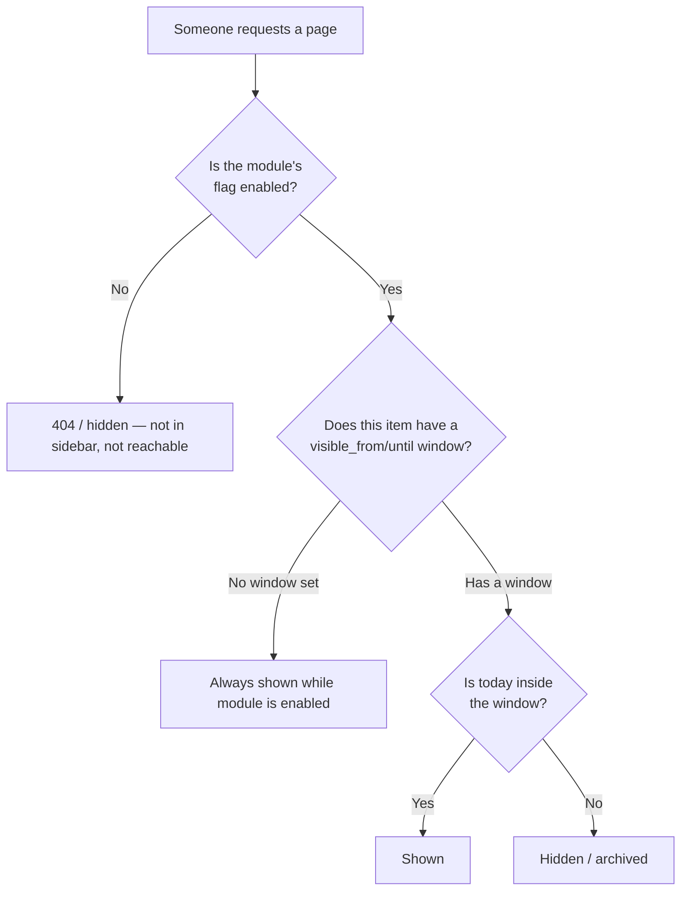

# Feature: Feature Flags

## What It Is
A **feature flag** is an on/off switch for a whole module (Home, Events, Hackathons, CodeFest, Codequest, Career, Membership, Resources, Community, Blog) that an admin controls from the Admin Panel — with **no code deployment required**. Flip it off, and that module vanishes from the sidebar and becomes unreachable for regular users; flip it on, and it reappears instantly.

## Why It Exists
Clubs run in seasons. Hackathons aren't happening year-round; Career drives cluster around placement season; some modules might be built but not ready to announce yet. Without feature flags, "hiding" a module would mean asking a developer to comment out code and redeploy — slow, risky, and a bottleneck on one person. With feature flags, any Admin or Club Lead can control platform visibility in seconds.

## Two Layers of Visibility

Feature flags control the platform at **two levels**, which work together:

### 1. Module-level flag (manual, admin-controlled)
A simple on/off switch per module. Example: Admin turns "Hackathons" **off** in the off-season → the module disappears from the sidebar entirely for all users (except Admins, who can still see it greyed-out in the admin panel).

### 2. Item-level, date-based visibility (documented design, not implemented)

> **Gap between this doc and the code.** Everything below this line describes
> the *target* design for item-level scheduling. Checked against the actual
> models and views: `Event` and `Hackathon` do have `visible_from`/`visible_until`
> columns (and `Event`'s serializer lets an admin set them), but **no view,
> queryset, or serializer on either app ever reads those fields to filter
> what's shown** — they're stored and editable, but have zero effect on what
> a visitor sees. `FeatureFlag` itself is a plain `is_enabled` boolean with no
> date fields at all. Blog posts have no scheduling field of any kind. The one
> item type that genuinely does auto-show/hide by date is a
> [Codequest](../modules/codequest.md) problem — via a simple `scheduled_date <= today`
> read-time filter, not a `visible_from`/`visible_until` window. See
> [scheduling.md](scheduling.md) for the full per-item breakdown.

The design intent, once/if built, would work like this:

## How Admins Use It Today

| Action | Where | Effect |
|---|---|---|
| Toggle a module on/off | Admin → Modules (see [../admin/module-management-feature-flags.md](../admin/module-management-feature-flags.md)) | Module appears/disappears from sidebar for everyone except Admins — this part is real and working. |
| Set an Event's `visible_from`/`visible_until` | Inside the event's edit screen | Saved to the database, but **has no effect on visibility** — the event is shown or hidden purely by the module flag and its own normal listing logic. Not implemented for Hackathons, Blog, or Codequest. |

## Related Docs
- [../admin/module-management-feature-flags.md](../admin/module-management-feature-flags.md) — how to actually flip a module flag
- [scheduling.md](scheduling.md) — the real, per-item status of scheduling across the platform
- Every module doc (e.g. [../modules/events.md](../modules/events.md)) has a "Visibility Rules" section — treat any item-level date-window claim there the same way as this doc's gap note above
