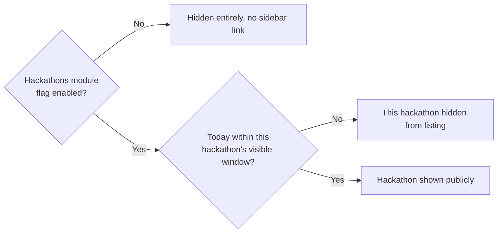
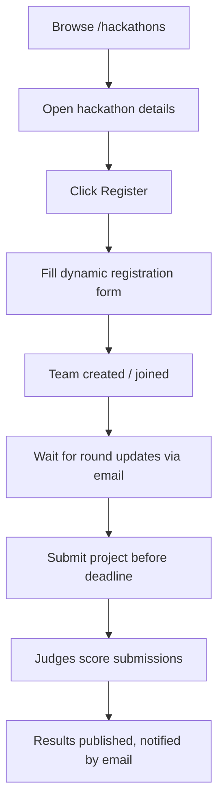

# Module: Hackathons

## Overview
The Hackathons module is the generic engine for running any hackathon on the platform — team formation, registration, round-by-round progression, judging, and results. [IconCoders](iconcoders.md), the club's flagship annual hackathon, is built on top of this module. Smaller or one-off hackathons also use this same engine.

## Who It's For
- **Participants** — students who register, form/join teams, submit projects.
- **Judges/Mentors** — review submissions, score teams.
- **Organizers (Club Leads/Admins)** — set up the hackathon, manage rounds, publish results.

## Public Pages

| Page | Path (example) | What it shows | Visible to |
|---|---|---|---|
| Hackathons listing | `/hackathons` | All hackathons that are currently flagged "visible" (upcoming, ongoing, or configured to still show past results) | Everyone |
| Hackathon details | `/hackathons/[slug]` | Theme, timeline, prizes, rules, sponsors, registration button | Everyone |
| Registration form | `/hackathons/[slug]/register` | Dynamic form (team info, member details, track selection) | Logged-in members |
| Team dashboard | `/hackathons/[slug]/team` | Team's registration status, submission upload, round updates | Registered participants |
| Results page | `/hackathons/[slug]/results` | Winners, standings (published only after organizer releases results) | Everyone (once published) |

## Admin Pages

| Page | Path (example) | What it does | Who can access |
|---|---|---|---|
| Hackathon manager | `/admin/hackathons` | Create/edit a hackathon: dates, tracks, prize pool, rounds | Admin, Club Lead |
| Registration form builder | `/admin/hackathons/[slug]/form` | Build the registration form using the [Dynamic Form Builder](../features/dynamic-form-builder.md) | Admin, Club Lead |
| Team & submissions view | `/admin/hackathons/[slug]/teams` | See all registered teams, download submissions, message teams | Admin, Club Lead, Volunteer (view-only) |
| Judging panel | `/admin/hackathons/[slug]/judging` | Judges score teams against criteria | Judge (special role), Admin |
| Results publisher | `/admin/hackathons/[slug]/results` | Compile scores, publish final results (triggers notification emails) | Admin, Club Lead |

## Visibility Rules (Feature Flag + Event Dates)
A hackathon's listing/detail page is controlled by **two layers**:
1. **Module-level flag** — the whole "Hackathons" module can be hidden from the sidebar entirely (e.g. during an off-season). See [Feature Flags](../features/feature-flags.md).
2. **Per-hackathon date-based visibility** — each hackathon has a `visible_from` / `visible_until` date. Outside that window it's automatically hidden from `/hackathons` and the sidebar, even if the module itself is enabled — no manual toggling needed. Organizers can also override this manually (e.g. keep a past hackathon's results page public indefinitely).

## User Flow (Participant)

## Key Features Used
- [Dynamic Form Builder](../features/dynamic-form-builder.md) — registration forms
- [Feature Flags](../features/feature-flags.md) — module + date-based visibility
- [Scheduling](../features/scheduling.md) — auto open/close registration, auto-publish results
- [Custom Email & Notifications](../features/email-notifications.md) — confirmations, round updates, results
- [File & Image Management](../features/file-image-management.md) — project submissions, posters
- [Role Based Access](../features/role-based-access.md) — Judge role, Organizer permissions
- [Data Export](../features/data-export.md) — exporting registrations for offline use (check-in sheets, etc.)

## Data Captured
Team name, member details, college/branch/year, track/theme selection, project submission links/files, judge scores.

## Roles Involved
Participant, Team Lead, Judge, Volunteer, Club Lead, Admin. See [../features/role-based-access.md](../features/role-based-access.md).

## Related Docs
- [iconcoders.md](iconcoders.md) — the flagship hackathon built on this module
- [../admin/event-hackathon-management.md](../admin/event-hackathon-management.md)
