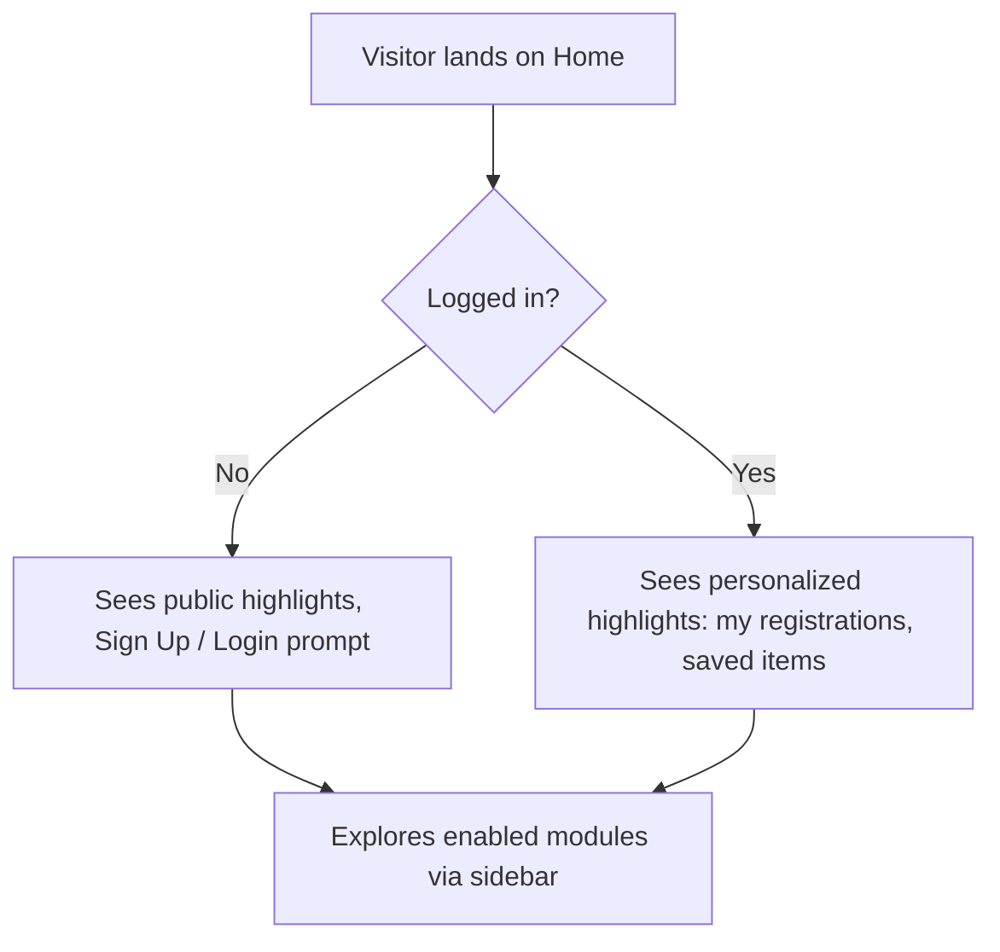

# Module: Home

## Overview
The Home module is the landing page of the platform — the first thing anyone sees, member or visitor. It's a summary/dashboard of what's happening across every other module: latest events, open hackathons, today's coding problem, recent blog posts, and quick links.

## Who It's For
Everyone — public visitors, prospective members, and logged-in members. Logged-in members see a slightly personalized version (their registrations, saved items).

## Public Pages

| Page | Path (example) | What it shows | Visible to |
|---|---|---|---|
| Landing page | `/` | Hero banner, club intro, highlights carousel (active events/hackathons), stats (members, events run) | Everyone |
| Sidebar / Navigation | (all pages) | Links to every **enabled** module — modules that are feature-flagged off simply don't appear | Everyone |

## Admin Pages

| Page | Path (example) | What it does | Who can access |
|---|---|---|---|
| Homepage content editor | `/admin/home` | Edit hero banner text/image, choose which highlights/announcements appear | Admin, Club Lead |
| Announcement manager | `/admin/announcements` | Create time-bound announcements (e.g. "Registrations open!") shown on Home | Admin, Club Lead |

## Visibility Rules
The Home page itself is always visible (it can't be feature-flagged off). However, **everything Home links to or highlights respects each module's own feature flag** — if "Hackathons" is disabled, no hackathon card appears on Home and no link to it appears in the sidebar. See [../features/feature-flags.md](../features/feature-flags.md).

## User Flow

## Key Features Used
- [Feature Flags](../features/feature-flags.md) — decides what appears on Home and in the sidebar
- [Analytics & Insights](../features/analytics-insights.md) — powers the stats shown on the homepage

## Data Captured
None directly — Home is a display/aggregation surface. Any sign-up happens through the Membership/auth flow, not a form on this page.

## Roles Involved
- **Public visitor** — read-only
- **Member** — read-only, personalized
- **Club Lead / Admin** — can edit banner and announcements

## Related Docs
- [../features/feature-flags.md](../features/feature-flags.md)
- [../admin/README.md](../admin/README.md)
