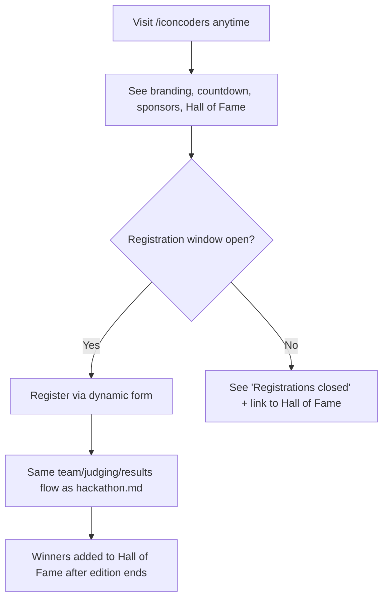

# Module: IconCoders (Flagship Hackathon)

## Overview
**IconCoders** is SRKR Coding Club's flagship, annual, marquee hackathon — the club's biggest single event of the year. It is *not* a separate technical module; it runs entirely on the generic [Hackathons module](hackathon.md) engine, but gets its own branded landing experience, dedicated sponsors section, and a permanent "Hall of Fame" page for past winners, because of its scale and importance to the club's identity.

Think of it this way: **Hackathons = the engine, IconCoders = the flagship car built on it.**

## Who It's For
Same participant/judge/organizer roles as any hackathon (see [hackathon.md](hackathon.md)), plus:
- **Sponsors** — external orgs whose logos/links appear on the IconCoders page.
- **Alumni/Public** — browse the Hall of Fame even outside registration windows.

## Public Pages

| Page | Path (example) | What it shows | Visible to |
|---|---|---|---|
| IconCoders landing | `/iconcoders` | Branded hero, theme for the year, countdown timer, sponsors, "Register" CTA | Everyone (always, unlike a normal hackathon page) |
| Registration | `/iconcoders/register` | Dynamic registration form for the current year's edition | Logged-in members, during registration window |
| Hall of Fame | `/iconcoders/hall-of-fame` | Past winners, year-by-year archive, standout projects | Everyone, always visible |
| Live/results | `/iconcoders/results` | Current or most recent edition's results | Everyone (once published) |

## Admin Pages

| Page | Path (example) | What it does | Who can access |
|---|---|---|---|
| IconCoders edition manager | `/admin/iconcoders/editions` | Create a new year's edition (theme, dates, sponsors, prize pool) — internally, this creates a new [Hackathons](hackathon.md) entry tagged as "flagship" | Admin, Club Lead |
| Sponsor manager | `/admin/iconcoders/sponsors` | Add/remove sponsor logos, links, tiers | Admin, Club Lead |
| Hall of Fame editor | `/admin/iconcoders/hall-of-fame` | Curate which past results/highlights appear permanently | Admin, Club Lead |

*All other admin functionality (registration form, teams, judging, results) is identical to the [Hackathons module](hackathon.md) — IconCoders editions appear inside the same Hackathon manager, just flagged as "flagship."*

## Visibility Rules
- The **IconCoders landing page and Hall of Fame are always visible** in the sidebar — they don't disappear between editions, since the brand itself is permanent (unlike a normal one-off hackathon).
- The **current edition's registration** follows the same date-based show/hide as any hackathon (see [hackathon.md](hackathon.md#visibility-rules-feature-flag--event-dates)): the "Register" button/page is only live within that year's registration window; outside it, the page shows "Registrations closed — see you next year" instead of a form.
- The whole IconCoders page can still be hidden entirely via the module-level flag if, e.g., the club decides to pause the flagship event for a year — but this is a deliberate admin action, not date-automated.

## User Flow

## Key Features Used
Everything listed under [hackathon.md — Key Features Used](hackathon.md#key-features-used), plus:
- [File & Image Management](../features/file-image-management.md) — sponsor logos, Hall of Fame photos

## Data Captured
Same as [hackathon.md](hackathon.md#data-captured), plus sponsor details and Hall of Fame archive entries (winning team, project name, year, photos).

## Roles Involved
Same as [hackathon.md](hackathon.md#roles-involved).

## Related Docs
- [hackathon.md](hackathon.md) — the underlying engine
- [../admin/event-hackathon-management.md](../admin/event-hackathon-management.md)
